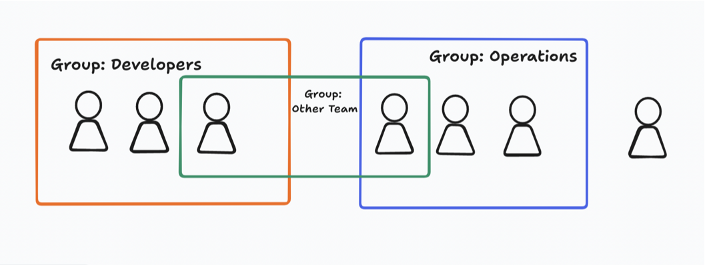
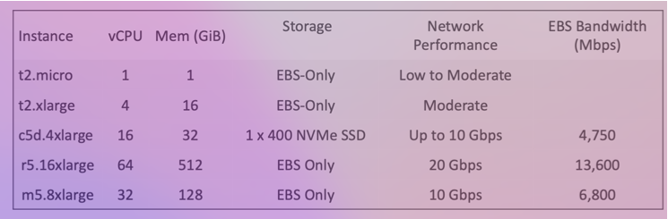
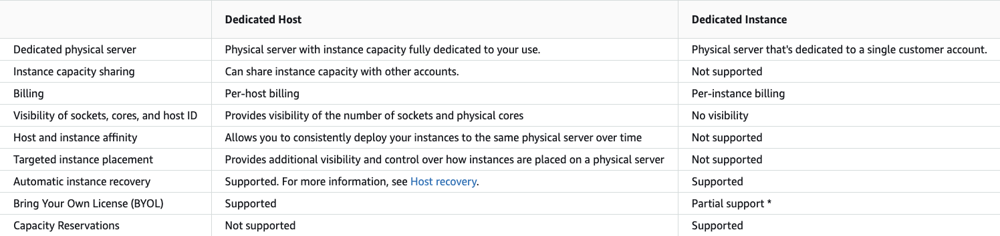

# Aws Solutions Architect Associate Notes

> Click ⭐ if you like the project.

## Visit Document Website

https://aws-solutions-architect-associate-notes.vercel.app

### Table of Contents

| No. | Questions                                                                 |
| --- | ------------------------------------------------------------------------- |
|     | **AWS**                                                                   |
| 1   | [What is AWS?](#what-is-AWS)                                              |
| 2   | [AWS Cloud Use Cases](#AWS-Cloud-Use-Cases)                               |
| 3   | [Global Services](#Global-Services)                                       |
| 4   | [Region-scoped Services](#Region-scoped-Services)                         |
|     | **AWS IAM (AWS Identity and Access Management)**                          |
| 1   | [What is IAM?](#what-is-IAM)                                              |
| 2   | [IAM features](#IAM-features)                                             |
| 3   | [Accessing IAM](#Accessing-IAM)                                           |
| 4   | [Users & Groups](#Users-&-Groups)                                         |
| 5   | [Permissions](#Permissions)                                               |
| 6   | [Roles for Services](#Roles-for-Services)                                 |
| 7   | [Permissions](#Permissions)                                               |
| 8   | [Security Tools](#Security-Tools)                                         |
| 9   | [Guidelines & Best Practices](#Guidelines-&-Best-Practices)               |
|     | **Amazon EC2 – Fundamentals**                                             |
| 1   | [What is Amazon EC2?](#what-is-Amazon-EC2)                                |
| 2   | [EC2 sizing & configuration options](#EC2-sizing-&-configuration-options) |
| 3   | [EC2 InstanceTypes - Overview](#EC2-InstanceTypes---Overview)             |
| 4   | [EC2 InstanceTypes - Example](#EC2-InstanceTypes---Example)               |
| 5   | [Introduction to Security Groups](#Introduction-to-Security-Groups)       |
| 6   | [Classic Ports](#Classic-Ports)                                           |
| 7   | [SSH Summary Table](#SSH-Summary-Table)                                   |
| 8   | [EC2 Instances Purchasing Options](#EC2-Instances-Purchasing-Options)     |
|     | **Amazon EC2 – Solutions Architect Associate Level**                      |
| 1   | [Private vs Public IP (IPv4)](<#Private-vs-Public-IP-(IPv4)>)             |
| 2   | [Placement groups](#Placement-groups)                                     |

## AWS

1. ### What is AWS?

   AWS (Amazon Web Services) is a comprehensive, evolving cloud computing platform provided by Amazon. It includes a mixture of **infrastructure-as-a-service (IaaS)**, **platform-as-a-service (PaaS)** and packaged **software-as-a-service (SaaS)** offerings. AWS offers tools such as compute power, database storage and content delivery services.

2. ### AWS Cloud Use Cases

   - AWS helps you create powerful and flexible apps that can grow as needed.
   - Suitable for many different types of businesses.
   - Here are some simplified use cases:
     - **Enterprise IT, Backup & Storage, Big Data Analytics:** This involves managing and storing data for large companies, analyzing that data for insights, and ensuring it's safely backed up.
     - **Website Hosting, Mobile & Social Apps:** Providing the infrastructure and support for hosting websites, mobile applications, and social media apps.
     - **Gaming:** Developing and/or hosting video games for various platforms.

3. ### Global Services

   - Identity and Access Management (IAM)
   - Route 53 (DNS service)
   - CloudFront (Content Delivery Network)
   - WAF (Web Application Firewall)

4. ### Region-scoped Services

   - Amazon EC2 (Infrastructure as a Service)
   - Elastic Beanstalk (Platform as a Service)
   - Lambda (Function as a Service)
   - Rekognition (Software as a Service)
   - [List of AWS Services Available by Region](https://aws.amazon.com/about-aws/global-infrastructure/regional-product-services/)

## IAM (AWS Identity and Access Management)

1. ### What is IAM?

   AWS Identity and Access Management (IAM) is like a bouncer for your AWS resources. It's a tool that lets you decide who gets into the party (your AWS resources) and what they're allowed to do once they're inside. So, you can manage who can access your stuff and what actions they can take, all from one central place.

2. ### IAM features

   - Shared access to your AWS account
   - Granular permissions
   - Secure access to AWS resources for applications that run on Amazon EC2
   - Multi-factor authentication (MFA)
   - Identity federation
   - Identity information for assurance
   - PCI DSS Compliance
   - Integrated with many AWS services
   - Eventually Consistent
   - Free to use

3. ### Accessing IAM

   - AWS Management Console (protected by password + MFA)
   - AWS Command Line Interface (CLI): protected by access keys
   - AWS Software Developer Kit (SDK) - for code: protected by access keys
   - IAM Query API

4. ### Users & Groups

   - Root account is automatically made, but don't use or share it.
   - Users are people within your organization, and can be grouped
   - Groups only contain users, not other groups
   - Users don’t have to belong to a group, and user can belong to multiple groups

   

5. ### Permissions

   - **Users or Groups** can be assigned JSON documents called policies
   - These policies define the **permissions** of the users
   - In AWS you apply the **least privilege principle:** don’t give more permissions than a user needs

6. ### Policies Structure

   - Consists of

     - Version: policy language version,alwaysinclude “2012-10- 17”
     - Id: an identifier for the policy (optional)
     - Statement: one or more individual statements (required)

   - Statements consists of
     - Sid: an identifier for the statement (optional)
     - Effect: whether the statement allows or denies access (Allow, Deny)
     - Principal: account/user/role to which this policy applied to
     - Action: list of actions this policy allows or denies
     - Resource: list of resources to which the actions applied to
     - Condition: conditions for when this policy is in effect (optional)

```
{
  "Version": "2012-10-17",
  "Statement": [
    {
      "Sid": "FirstStatement",
      "Effect": "Allow",
      "Action": ["iam:ChangePassword"],
      "Resource": "*"
    },
    {
      "Sid": "SecondStatement",
      "Effect": "Allow",
      "Action": "s3:ListAllMyBuckets",
      "Resource": "*"
    },
    {
      "Sid": "ThirdStatement",
      "Effect": "Allow",
      "Action": [
        "s3:List*",
        "s3:Get*"
      ],
      "Resource": [
        "arn:aws:s3:::confidential-data",
        "arn:aws:s3:::confidential-data/*"
      ],
      "Condition": {"Bool": {"aws:MultiFactorAuthPresent": "true"}}
    }
  ]
}

```

7. ### Roles for Services

   - Some AWS service will need to perform actions on your behalf
   - To do so, we will assign permissions to AWS services with IAM Roles
   - Common roles:
     - EC2 Instance Roles
     - Lambda Function Roles
     - Roles for CloudFormation

8. ### Security Tools

   - IAM Credentials Report (account-level)
   - a report that lists all your account's users and the status of their various credentials

   - IAM Access Advisor (user-level)
     - Access advisor shows the service permissions granted to a user and when those services were last accessed.
     - You can use this information to revise your policies.

9. ### Guidelines & Best Practices

   - Don’t use the root account except for AWS account setup
   - One physical user = One AWS user
   - **Assign users to groups** and assign permissions to groups
   - Create a **strong password** policy
   - Use and enforce the use of **Multi Factor Authentication (MFA)**
   - Create and use **Roles** for giving permissions to AWS services
   - Use Access Keys for Programmatic Access (CLI / SDK)
   - Audit permissions of your account using IAM Credentials Report & IAM Access Advisor
   - **Never share IAM users & Access Keys**

## Amazon EC2 – Fundamentals

1. ### What is Amazon EC2?

   - EC2 is one of the most popular of AWS’ offering
   - EC2 = Elastic Compute Cloud = Infrastructure as a Service
   - It mainly consists in the capability of :
     - Renting virtual machines (EC2 - Elastic Compute Cloud)
     - Storing data on virtual drives (EBS - Elastic Block Store)
     - Distributing load across machines (ELB - Elastic Load Balancing)
     - Scaling the services using an auto-scaling group (ASG - Auto Scaling Group )

2. ### EC2 sizing & configuration options

   - Operating System: Linux, Windows or Mac OS
   - How much **CPU** and **RAM**
   - Storage space
     - Network-attached (**EBS** - Elastic Block Store & **EFS** - Elastic File System)
     - Hrdware (EC2 Instance Store)
   - Network card: Speed of the card, Public IP address
   - Firewall rules: Security group
   - Bootstrap script (configure at first launch): EC2 User Data
     - Used to automate boot tasks
       - Example:
         - Installing updates
         - Installing software
         - Downloading common files from the internet
         - Anything you can think of
     - Runs with the root user

3. ### EC2 InstanceTypes - Overview

   - Different types of EC2 instances that are optimised for different use cases [Check here](https://aws.amazon.com/ec2/instance-types/)

     - **General Purpose** : M6a, M6g, M6gd, M6i, M6id, M6idn, M6in, M7a, M7g, M7gd, M7i, M7i-flex, T4g

       - Use cases:
         - Great for a diversity of workloads such as web servers or code repositories
           - Balance between:
             - Compute
             - Memory
             - Networking

     - **Compute Optimized** : C6a, C6g, C6gd, C6gn, C6i, C6id, C6in, C7a, C7g, C7gd, C7gn, C7i

       - Use cases:
         - Great for compute-intensive tasks that require high performance processors:
           - Batch processing workloads
           - Media transcoding
           - High performance web servers
           - High performance computing (HPC)
           - Scientific modeling & machine learning

     - **Memory Optimized** : R6a, R6g, R6gd, R6i, R6id, R6idn, R6in, R7a, R7g, R7gd, R7i, R7iz, X2gd, X2idn, X2iedn

       - Use cases:
         - Fast performance for workloads that process large data sets in memory
         - High performance, relational/non-relational databases
         - Distributed web scale cache stores
         - In-memory databases optimized for BI (business intelligence)
         - Applications performing real-time processing of big unstructured data

     - **Accelerated Computing** : DL2q, G5g, Inf2, P5, Trn1, Trn1n

       - Use cases:
         - Accelerated computing instances use hardware accelerators or co-processors.
         - They perform functions like floating-point number calculations, graphics processing, or data pattern matching.
         - These functions are done more efficiently compared to software running on CPUs.

     - **Storage Optimized** : I4g, I4i, Im4gn, Is4gen

       - Use cases:
         - Designed for workloads needing high sequential read/write access to large data sets
         - Optimized for delivering tens of thousands of low-latency, random IOPS
         - Ideal for applications with heavy data processing needs
         - Local storage ensures faster access compared to network storage
         - Suitable for data-intensive tasks like database management, analytics, and data warehousing

     - **HPC Optimized (High performance computing)** : Hpc6a, Hpc6id, Hpc7a, Hpc7g

       - Use cases:
         - HPC instances on AWS are designed for running high-performance computing workloads efficiently.
         - They offer optimized price-performance for scaling HPC tasks.
         - Ideal for applications requiring robust processing power, like complex simulations and deep learning tasks.
         - Suited for large-scale operations where performance is critical.
         - Tailored with high-performance processors to enhance computational capabilities.

     - **Instance Features**

       - Use cases:

         - **Scalability**: Easily scale your applications up or down based on demand.
         - **Management Tools**: Access a variety of tools to streamline deployment and management processes.
         - **Monitoring**: Monitor the performance of your applications in real-time.
         - **Flexibility**: Choose from a wide range of instance types to suit your specific needs.
         - **Security**: Benefit from built-in security features to protect your applications and data.
         - **Integration**: Seamlessly integrate with other AWS services for enhanced functionality.
         - **Cost-Effectiveness**: Pay only for the resources you use, with cost-effective pricing models.
         - **Reliability**: Rely on Amazon's robust infrastructure for high availability and reliability.

         - Burstable Performance Instances
         - Multiple Storage Options
         - EBS-optimized Instances
         - Cluster Networking
         - Intel Processor Features

     - **Measuring Instance Performance**

       - Use cases:

         - Amazon EC2 offers various instance types with different specifications:
           - CPU
           - Memory
           - Disk
           - Networking
         - Launching new instances and running tests simultaneously is straightforward.
         - It's advised to measure application performance to select suitable instance types and confirm application architecture.
         - Rigorous load and scale testing is recommended to ensure desired application scalability.

4. ### EC2 InstanceTypes - Example

   - 
   - **_t2.micro is part of the AWS free tier (up to 750 hours per month)_**
   - For more details [check here](https://instances.vantage.sh/)

5. ### Introduction to Security Groups

   - Fundamental of network security in AWS
   - They control how traffic is allowed into or out of our EC2 Instances.
     - Inbound traffic
     - Outbound traffic
   - Only contain **allow** rules
   - Rules can reference by IP or by security group
   - Acting as a “firewall” on EC2 instances
     - Access to Ports
     - Authorised IP ranges – IPv4 and IPv6
     - Control of inbound network (from other to the instance)
     - Control of outbound network (from the instance to other)
   - Can be attached to multiple instances
   - It’s good to maintain one separate security group for SSH access
   - All inbound traffic is **blocked** by default
   - All outbound traffic is **authorised** by default

6. ### Classic Ports

   - 22 = SSH (Secure Shell) - log into a Linux instance
   - 21 = FTP (File Transfer Protocol) – upload files into a file share
   - 22 = SFTP (Secure File Transfer Protocol) – upload files using SSH
   - 80 = HTTP – access unsecured websites
   - 443 = HTTPS – access secured websites
   - 3389 = RDP (Remote Desktop Protocol) – log into a Windows instance

7. ### SSH Summary Table

   |              | SSH | Putty | EC2 Instance Connect |
   | ------------ | --- | ----- | -------------------- |
   | Mac          | ☑   |       | ☑                    |
   | Linux        | ☑   |       | ☑                    |
   | Window < 10  |     | ☑     | ☑                    |
   | Window >= 10 | ☑   | ☑     | ☑                    |

   - SSH using mac:

     - ssh -i EC2-instatnce-key ec2-user@<public-ip> (ex: ec2-user@35.180.242.162)
     - ssh -i ec2-test-v2.pem ec2-user@35.180.242.162

   - EC2 Instance Connect
     - Connect to your EC2 instance within your browser
     - No need to use your key file that was downloaded (Works only out-of-the-box with Amazon Linux 2)
     - Goto EC2 > Instances > <your-instance> > Connect to instance > Connect action

8. ### EC2 Instances Purchasing Options

   - **On-Demand Instances** – short workload, predictable pricing, pay by second

     - Pay for what you use:
       - Linux or Windows - billing per second, after the first minute
       - All other operating systems - billing per hour
     - Has the highest cost but no upfront payment
     - No long-term commitment
     - Recommended for short-term and un-interrupted workloads, where you can't predict how the application will behave

   - **Reserved** (1 & 3 years)

     - Reserved Instances – long workloads
     - Convertible Reserved Instances – long workloads with flexible instances
     - You reserve a specific instance attributes (Instance Type, Region,Tenancy, OS)
     - Reservation Period – 1 year (+discount) or 3 years (+++discount)
     - Payment Options – No Upfront (+), Par tial Upfront (++), All Upfront (+++)
     - Reserved Instance’s Scope – Regional or Zonal (reserve capacity in an AZ)
     - Recommended for steady-state usage applications (think database)
     - You can buy and sell in the Reserved Instance Marketplace
     - Convertible Reserved Instance
     - Can change the EC2 instance type, instance family, OS, scope and tenancy - Up to 66% discount

   - **Savings Plans** (1 & 3 years) – commitment to an amount of usage, long workload - Spot Instances – short workloads, cheap, can lose instances (less reliable)

     - Get a discount based on long-term usage (up to 72% - same as RIs)
     - Commit to a certain type of usage ($10/hour for 1 or 3 years)
     - Usage beyond EC2 Savings Plans is billed at the On-Demand price
     - Locked to a specific instance family & AWS region (e.g., M5 in us-east-1)
     - Flexible across:
       - Instance Size (e.g., m5.xlarge, m5.2xlarge)
       - OS (e.g., Linux, Windows)
       - Tenancy (Host, Dedicated, Default)

   - **Spot Instances** -

     - Can get a discount of up to 90% compared to On-demand
     - Instances that you can “lose” at any point of time if your max price is less than the current spot price
     - The MOST cost-efficient instances in AWS
     - Useful for workloads that are resilient to failure
       - Batch jobs
       - Data analysis
       - Image processing
       - Any distributed workloads
       - Workloads with a flexible start and end time
     - Not suitable for critical jobs or databases

   - **Dedicated Hosts** – book an entire physical server, control instance placement

     - A physical server with EC2 instance capacity fully dedicated to your use
     - Allows you address **compliance requirements** and **use your existing server- bound software licenses** (per-socket, per-core, pe—VM software licenses)
     - Purchasing Options:
       - **On-demand** – pay per second for active Dedicated Host
       - **Reserved** - 1 or 3 years (No Upfront, Partial Upfront,All Upfront)
     - The most expensive option
     - Useful for software that have complicated licensing model (BYOL – Bring Your
       Own License)
     - Or for companies that have strong regulatory or compliance needs

   - **Dedicated Instances** – no other customers will share your hardware

     - Instances run on hardware that’s dedicated to you
     - May share hardware with other instances in same account
     - No control over instance placement (can move hardware after Stop / Start)

   - 

   - **Capacity Reservations** – reserve capacity in a specific AZ for any duration

     - Reserve On-Demand instances capacity in a specific AZ for any duration
     - You always have access to EC2 capacity when you need it
     - No time commitment (create/cancel anytime), no billing discounts
     - Combine with Regional Reserved Instances and Savings Plans to benefit from billing discounts
     - You’re charged at On-Demand rate whether you run instances or not
     - Suitable for short-term, uninterrupted workloads that needs to be in a specific AZ

   - **EC2 Spot Instance Requests**

     - Can get a discount of up to 90% compared to On-demand
     - Define **max spot price** and get the instance while **current spot price** < **max**
       - If the current spot price > your max price you can choose to stop or terminate your instance with a 2 minutes grace period.
     - Used for batch jobs, data analysis, or workloads that are resilient to failures.
     - Not great for critical jobs or databases

   - **Spot Fleets**
     - Spot Fleets = set of Spot Instances + (optional) On-Demand Instances
     - The Spot Fleet will try to meet the target capacity with price constraints
     - Strategies to allocate Spot Instances:
       - lowestPrice: from the pool with the lowest price (cost optimization, short workload)
       - diversified: distributed across all pools (great for availability, long workloads)
       - capacityOptimized: pool with the optimal capacity for the number of instances
       - priceCapacityOptimized (recommended): pools with highest capacity available, then select the pool with the lowest price (best choice for most workloads)
     - Spot Fleets allow us to automatically request Spot Instances with the lowest price

## Amazon EC2 – Solutions Architect Associate Level

1. ### Private vs Public IP (IPv4)

- Networking has two sorts of IPs. IPv4 and IPv6:
  - IPv4:1.160.10.240
  - IPv6:3ffe:1900:4545:3:200:f8ff:fe21:67cf
- IPv4 is still the most common format used online.
- IPv6 is **newer** and solves problems for the Internet of Things (IoT).
- IPv4 allows for 3.7 billion different addresses in the public space
- IPv4: [0-255].[0-255].[0-255].[0-255].

- **Public IP:**

  - Public IP means the machine can be identified on the internet (WWW)
  - Must be unique across the whole web (not two machines can have the same public IP).
  - Can be geo-located easily

- **Private IP:**

  - Private IP means the machine can only be identified on a private network only
  - The IP must be unique across the private network
  - BUT two different private networks (two companies) can have the same IPs.
  - Machines connect to WWW using a NAT + internet gateway (a proxy)
  - Only a specified range of IPs can be used as private IP

- **Private IP:**

  - When you stop and then start an EC2 instance, it can change its public IP.
  - If you need to have a fixed public IP for your instance, you need an Elastic IP
  - An Elastic IP is a public IPv4 IP you own as long as you don’t delete it
  - You can attach it to one instance at a time
  - You can only have 5 Elastic IP in your account (you can ask AWS to increase that).

2. ### Placement groups

- To handle your workload better, you can put a bunch of connected EC2 computers together in a placement group to control where they go.
- Depending on what you're doing, you can set up a placement group in different ways:

  - **Cluster** : Grouping instances into a low-latency cluster within one Availability Zone.

    Pros:

    - Excellent network speed (10 Gbps bandwidth) when using Enhanced Networking.

    Cons:

    - If the rack (a collection of servers) fails, all instances (computing units) fail simultaneously.

    Use Case:

    - Big Data tasks requiring speedy completion.
    - Applications demanding ultra-low latency and high network speed.

  - **Partition** : Distribute tasks to different pieces of equipment (up to 7 tasks per group in each area).

    Pros:

    - **Availability:** Spans across different availability zones (AZs), enhancing availability.
    - **Reduced Risk:** Decreases the risk of simultaneous failures.
    - **Isolation:** EC2 instances are on separate physical hardware, reducing the impact of hardware failures.

    Cons:

    - **Limitation:** Restricted to 7 instances per AZ per placement group.

    Use Case:

    - **Maximized Availability:** Ideal for applications needing maximum uptime.
    - **Critical Applications:** Ensures isolation between instances, crucial for critical applications to prevent failure cascades.

  - **Spread** : Distributing tasks or data across various sections (called partitions), each using different groups of servers within a single availability zone (AZ). It can handle hundreds of virtual servers (EC2 instances) per category (like Hadoop, Cassandra, or Kafka).

    - Each "zone" (AZ) can have up to 7 separate parts.
    - These parts can spread out across multiple zones.
    - Hundreds of EC2 instances can be in use.
    - Instances within a part don't share space with those in other parts.
    - If one part fails, it only affects the instances in that part, not others.
    - EC2 instances can access part-specific info.
    - It's handy for systems like HDFS, HBase, Cassandra, or Kafka.

## Amazon EC2 – Instance Storage

# 🛡️ License

This project is licensed under the MIT License - see the [`LICENSE`](LICENSE) file for details.

# 👨‍💻 Author

### 👤 Asif Vora

- Github: [@asifvora](https://github.com/asifvora)
- LinkedIn: [@asif-vora](https://www.linkedin.com/in/asif-vora/)
- Twitter: [@007_dark_shadow](https://twitter.com/007_dark_shadow)
- Instagram: [@007_dark_shadow](https://www.instagram.com/007_dark_shadow/)

# 🍰 Contributing

- Please contribute using [GitHub Flow](https://guides.github.com/introduction/flow). Create a branch, add commits, and [open a pull request](https://github.com/asif-simform/MERN-Stack/compare).

- Please read [`CONTRIBUTING`](CONTRIBUTING.md) for details.

# 🙏 Support

This project needs a ⭐️ from you. Don't forget to leave a star ⭐️
