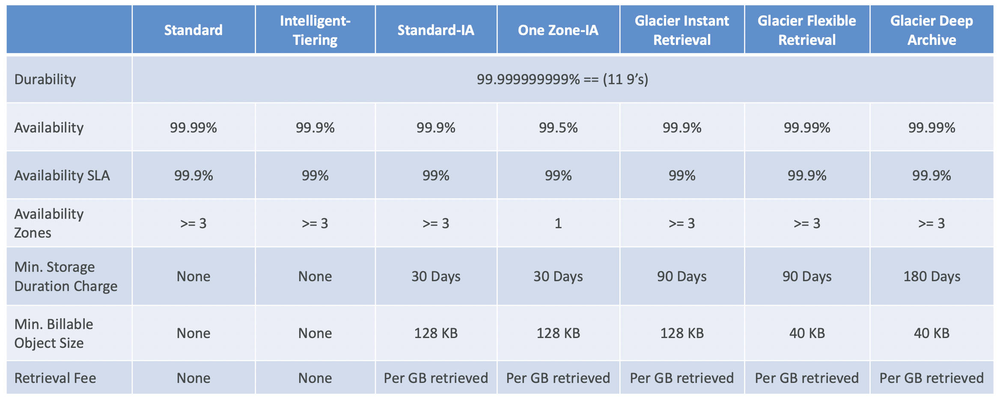
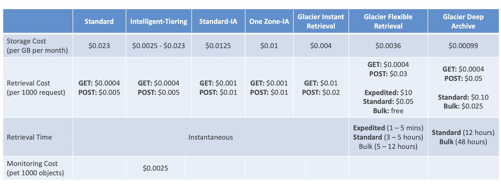

# Aws Solutions Architect Associate Notes

> Click ⭐ if you like the project.

## Visit Document Website

https://aws-solutions-architect-associate-notes.vercel.app

### Table of Contents

| No. | Questions                                                                                               |
| --- | ------------------------------------------------------------------------------------------------------- |
|     | **AWS**                                                                                                 |
| 1   | [What is AWS?](#what-is-AWS)                                                                            |
| 2   | [AWS Cloud Use Cases](#AWS-Cloud-Use-Cases)                                                             |
| 3   | [Global Services](#Global-Services)                                                                     |
| 4   | [Region-scoped Services](#Region-scoped-Services)                                                       |
|     | **AWS IAM (AWS Identity and Access Management)**                                                        |
| 1   | [What is IAM?](#what-is-IAM)                                                                            |
| 2   | [IAM features](#IAM-features)                                                                           |
| 3   | [Accessing IAM](#Accessing-IAM)                                                                         |
| 4   | [Users & Groups](#Users-&-Groups)                                                                       |
| 5   | [Permissions](#Permissions)                                                                             |
| 6   | [Roles for Services](#Roles-for-Services)                                                               |
| 7   | [Permissions](#Permissions)                                                                             |
| 8   | [Security Tools](#Security-Tools)                                                                       |
| 9   | [Guidelines & Best Practices](#Guidelines-&-Best-Practices)                                             |
|     | **Amazon EC2 – Fundamentals**                                                                           |
| 1   | [What is Amazon EC2?](#what-is-Amazon-EC2)                                                              |
| 2   | [EC2 sizing & configuration options](#EC2-sizing-&-configuration-options)                               |
| 3   | [EC2 InstanceTypes - Overview](#EC2-InstanceTypes---Overview)                                           |
| 4   | [EC2 InstanceTypes - Example](#EC2-InstanceTypes---Example)                                             |
| 5   | [Introduction to Security Groups](#Introduction-to-Security-Groups)                                     |
| 6   | [Classic Ports](#Classic-Ports)                                                                         |
| 7   | [SSH Summary Table](#SSH-Summary-Table)                                                                 |
| 8   | [EC2 Instances Purchasing Options](#EC2-Instances-Purchasing-Options)                                   |
|     | **Amazon EC2 – Solutions Architect Associate Level**                                                    |
| 1   | [Private vs Public IP (IPv4)](<#Private-vs-Public-IP-(IPv4)>)                                           |
| 2   | [Placement groups](#Placement-groups)                                                                   |
| 3   | [Elastic Network Interfaces (ENI)](<#Elastic-Network-Interfaces-(ENI)>)                                 |
| 4   | [EC2 Hibernate](#EC2-Hibernate)                                                                         |
|     | **Amazon Amazon EC2 – Instance Storage**                                                                |
| 1   | [EBS Overview](#EBS-Overview)                                                                           |
| 2   | [EBS Snapshots](#EBS-Snapshots)                                                                         |
| 3   | [AMI Overview](#AMI-Overview)                                                                           |
| 4   | [EC2 Instance Store](#EC2-Instance-Store)                                                               |
| 5   | [EBS Volume Types](#EBS-Volume-Types)                                                                   |
| 6   | [EBS Multi-Attach](#EBS-Multi-Attach)                                                                   |
| 7   | [EBS Encryption](#EBS-Encryption)                                                                       |
| 8   | [Amazon EFS](#Amazon-EFS)                                                                               |
| 9   | [EFS Vs EBS](#EFS-Vs-EBS)                                                                               |
|     | **High Availability & Scalability**                                                                     |
| 1   | [Scalability & High Availability](#Scalability-&-High-Availability)                                     |
| 2   | [Elastic Load Balancing (ELB) Overview](<#Elastic-Load-Balancing-(ELB)-Overview>)                       |
| 3   | [Classic Load Balancers (CLB)](<#Classic-Load-Balancers-(CLB)>)                                         |
| 4   | [Application Load Balancer (ALB)](<#Application-Load-Balancer-(ALB)>)                                   |
| 5   | [Network Load Balancer (NLB)](<#Network-Load-Balancer-(NLB)>)                                           |
| 6   | [Gateway Load Balancer (GWLB)](<#Gateway-Load-Balancer-(GWLB)>)                                         |
| 7   | [Elastic Load Balancer - Sticky Sessions](#Elastic-Load-Balancer---Sticky-Sessions)                     |
| 8   | [Elastic Load Balancer - Cross Zone Load Balancing](#Elastic-Load-Balancer---Cross-Zone-Load-Balancing) |
| 9   | [Elastic Load Balancer - SSL Certificates](#Elastic-Load-Balancer---SSL-Certificates)                   |
| 10  | [Elastic Load Balancer - Connection Draining](#Elastic-Load-Balancer---Connection-Draining)             |
| 11  | [Auto Scaling Groups (ASG) Overview](<#Auto-Scaling-Groups-(ASG)-Overview>)                             |
| 12  | [Auto Scaling Groups - Scaling Policies](#Auto-Scaling-Groups---Scaling-Policies)                       |
|     | **AWS Fundamentals: RDS + Aurora + ElastiCache**                                                        |
| 1   | [Amazon RDS Overview](#Amazon-RDS-Overview)                                                             |
| 2   | [RDS Read Replicas Vs Multi AZ](#RDS-Read-Replicas-Vs-Multi-AZ)                                         |
| 3   | [RDS Custom](#RDS-Custom)                                                                               |
| 4   | [Amazon Aurora](#Amazon-Aurora)                                                                         |
| 5   | [Amazon Aurora - Advanced Concepts](#Amazon-Aurora-Advanced-Concepts)                                   |
| 6   | [RDS & Aurora - Backup and Monitoring](#RDS-&-Aurora---Backup-and-Monitoring)                           |
| 7   | [RDS & Aurora Security](#RDS-&-Aurora-Security)                                                         |
| 8   | [Amazon RDS Proxy](#Amazon-RDS-Proxy)                                                                   |
| 9   | [Amazon ElastiCache Overview](#Amazon-ElastiCache-Overview)                                             |
| 10  | [ElastiCache for Solution Architects](#ElastiCache-for-Solution-Architects)                             |
| 11  | [List of Ports to be familiar](#List-of-Ports-to-be-familiar)                                           |
|     | **Amazon Route 53**                                                                                     |
| 1   | [What is DNS?](#What-is-DNS?)                                                                           |
| 2   | [Route 53 Overview](#Route-53-Overview)                                                                 |
| 3   | [Route 53 - TTL](#Route-53---TTL)                                                                       |
| 4   | [Route 53 CNAME vs Alias](#Route-53-CNAME-vs-Alias)                                                     |
| 5   | [Route 53 – Routing Policies](#Route-53-–-Routing-Policies)                                             |
| 6   | [Route 53 – Health Checks](#Route-53-–-Health-Checks)                                                   |
| 7   | [Domain Registar vs. DNS Service](#Domain-Registar-vs.-DNS-Service)                                     |
|     | **Beanstalk Overview**                                                                                  |
| 1   | [Elastic Beanstalk – Overview](#Elastic-Beanstalk-–-Overview)                                           |
| 2   | [Elastic Beanstalk – Components](#Elastic-Beanstalk-–-Components)                                       |
| 3   | [Elastic Beanstalk – Supported Platforms](#Elastic-Beanstalk-–-Supported-Platforms)                     |
|     | **Amazon S3 Introduction**                                                                              |
| 1   | [S3 Overview](#S3-Overview)                                                                             |
| 2   | [S3 Security: Bucket Policy](#S3-Security:-Bucket-Policy)                                               |
| 3   | [S3 Website Overview](#S3-Website-Overview)                                                             |
| 4   | [S3 Versioning](#S3-Versioning)                                                                         |
| 5   | [S3 Replication](#S3-Replication)                                                                       |
| 6   | [S3 Storage Classes Overview](#S3-Storage-Classes-Overview)                                             |
|     | **Advanced Amazon S3**                                                                                  |

## AWS

1. ### What is AWS?

   AWS (Amazon Web Services) is a comprehensive, evolving cloud computing platform provided by Amazon. It includes a mixture of **infrastructure-as-a-service (IaaS)**, **platform-as-a-service (PaaS)** and packaged **software-as-a-service (SaaS)** offerings. AWS offers tools such as compute power, database storage and content delivery services.

2. ### AWS Cloud Use Cases

   - AWS helps you create powerful and flexible apps that can grow as needed.
   - Suitable for many different types of businesses.
   - Here are some simplified use cases:
     - **Enterprise IT, Backup & Storage, Big Data Analytics:** This involves managing and storing data for large companies, analyzing that data for insights, and ensuring it's safely backed up.
     - **Website Hosting, Mobile & Social Apps:** Providing the infrastructure and support for hosting websites, mobile applications, and social media apps.
     - **Gaming:** Developing and/or hosting video games for various platforms.

3. ### Global Services

   - Identity and Access Management (IAM)
   - Route 53 (DNS service)
   - CloudFront (Content Delivery Network)
   - WAF (Web Application Firewall)

4. ### Region-scoped Services

   - Amazon EC2 (Infrastructure as a Service)
   - Elastic Beanstalk (Platform as a Service)
   - Lambda (Function as a Service)
   - Rekognition (Software as a Service)
   - [List of AWS Services Available by Region](https://aws.amazon.com/about-aws/global-infrastructure/regional-product-services/)

## IAM (AWS Identity and Access Management)

1. ### What is IAM?

   AWS Identity and Access Management (IAM) is like a bouncer for your AWS resources. It's a tool that lets you decide who gets into the party (your AWS resources) and what they're allowed to do once they're inside. So, you can manage who can access your stuff and what actions they can take, all from one central place.

2. ### IAM features

   - Shared access to your AWS account
   - Granular permissions
   - Secure access to AWS resources for applications that run on Amazon EC2
   - Multi-factor authentication (MFA)
   - Identity federation
   - Identity information for assurance
   - PCI DSS Compliance
   - Integrated with many AWS services
   - Eventually Consistent
   - Free to use

3. ### Accessing IAM

   - AWS Management Console (protected by password + MFA)
   - AWS Command Line Interface (CLI): protected by access keys
   - AWS Software Developer Kit (SDK) - for code: protected by access keys
   - IAM Query API

4. ### Users & Groups

   - Root account is automatically made, but don't use or share it.
   - Users are people within your organization, and can be grouped
   - Groups only contain users, not other groups
   - Users don’t have to belong to a group, and user can belong to multiple groups

   

5. ### Permissions

   - **Users or Groups** can be assigned JSON documents called policies
   - These policies define the **permissions** of the users
   - In AWS you apply the **least privilege principle:** don’t give more permissions than a user needs

6. ### Policies Structure

   - Consists of

     - Version: policy language version,alwaysinclude “2012-10- 17”
     - Id: an identifier for the policy (optional)
     - Statement: one or more individual statements (required)

   - Statements consists of
     - Sid: an identifier for the statement (optional)
     - Effect: whether the statement allows or denies access (Allow, Deny)
     - Principal: account/user/role to which this policy applied to
     - Action: list of actions this policy allows or denies
     - Resource: list of resources to which the actions applied to
     - Condition: conditions for when this policy is in effect (optional)

```
{
  "Version": "2012-10-17",
  "Statement": [
    {
      "Sid": "FirstStatement",
      "Effect": "Allow",
      "Action": ["iam:ChangePassword"],
      "Resource": "*"
    },
    {
      "Sid": "SecondStatement",
      "Effect": "Allow",
      "Action": "s3:ListAllMyBuckets",
      "Resource": "*"
    },
    {
      "Sid": "ThirdStatement",
      "Effect": "Allow",
      "Action": [
        "s3:List*",
        "s3:Get*"
      ],
      "Resource": [
        "arn:aws:s3:::confidential-data",
        "arn:aws:s3:::confidential-data/*"
      ],
      "Condition": {"Bool": {"aws:MultiFactorAuthPresent": "true"}}
    }
  ]
}

```

7. ### Roles for Services

   - Some AWS service will need to perform actions on your behalf
   - To do so, we will assign permissions to AWS services with IAM Roles
   - Common roles:
     - EC2 Instance Roles
     - Lambda Function Roles
     - Roles for CloudFormation

8. ### Security Tools

   - IAM Credentials Report (account-level)
   - a report that lists all your account's users and the status of their various credentials

   - IAM Access Advisor (user-level)
     - Access advisor shows the service permissions granted to a user and when those services were last accessed.
     - You can use this information to revise your policies.

9. ### Guidelines & Best Practices

   - Don’t use the root account except for AWS account setup
   - One physical user = One AWS user
   - **Assign users to groups** and assign permissions to groups
   - Create a **strong password** policy
   - Use and enforce the use of **Multi Factor Authentication (MFA)**
   - Create and use **Roles** for giving permissions to AWS services
   - Use Access Keys for Programmatic Access (CLI / SDK)
   - Audit permissions of your account using IAM Credentials Report & IAM Access Advisor
   - **Never share IAM users & Access Keys**

## Amazon EC2 – Fundamentals

1.  ### What is Amazon EC2?

    - EC2 is one of the most popular of AWS’ offering
    - EC2 = Elastic Compute Cloud = Infrastructure as a Service
    - It mainly consists in the capability of :
      - Renting virtual machines (EC2 - Elastic Compute Cloud)
      - Storing data on virtual drives (EBS - Elastic Block Store)
      - Distributing load across machines (ELB - Elastic Load Balancing)
      - Scaling the services using an auto-scaling group (ASG - Auto Scaling Group )

2.  ### EC2 sizing & configuration options

    - Operating System: Linux, Windows or Mac OS
    - How much **CPU** and **RAM**
    - Storage space
      - Network-attached (**EBS** - Elastic Block Store & **EFS** - Elastic File System)
      - Hrdware (EC2 Instance Store)
    - Network card: Speed of the card, Public IP address
    - Firewall rules: Security group
    - Bootstrap script (configure at first launch): EC2 User Data
      - Used to automate boot tasks
        - Example:
          - Installing updates
          - Installing software
          - Downloading common files from the internet
          - Anything you can think of
      - Runs with the root user

3.  ### EC2 InstanceTypes - Overview

    - Different types of EC2 instances that are optimised for different use cases [Check here](https://aws.amazon.com/ec2/instance-types/)

    - **General Purpose** : M6a, M6g, M6gd, M6i, M6id, M6idn, M6in, M7a, M7g, M7gd, M7i, M7i-flex, T4g

      - Use cases:
        - Great for a diversity of workloads such as web servers or code repositories
          - Balance between:
            - Compute
            - Memory
            - Networking
      - Series:
        - A Series (Medium, Large) : A1
        - M Series (Large) : M4, M5, M5a, M5ad, M5d
        - T Series : T2, T3, T3a

    - **Compute Optimized** :

      - Use cases:

        - Great for compute-intensive tasks that require high performance processors:
          - Web Server
          - Batch processing workloads
          - Media transcoding
          - High performance web servers
          - High performance computing (HPC)
          - Scientific modeling & machine learning

      - Series:
        - C Series : C4, C5, C5n, C6a, C6g, C6gd, C6gn, C6i, C6id, C6in, C7a, C7g, C7gd, C7gn, C7i

    - **Memory Optimized** : R6a, R6g, R6gd, R6i, R6id, R6idn, R6in, R7a, R7g, R7gd, R7i, R7iz, X2gd, X2idn, X2iedn

      - Use cases:

        - Fast performance for workloads that process large data sets in memory
        - High performance, relational/non-relational databases
        - Distributed web scale cache stores
        - In-memory databases optimized for BI (business intelligence)
        - Applications performing real-time processing of big unstructured data

      - Series:
        - R Series : R4, R5, R5a, R5d
        - X Series : X1, X1e
        - Z Series : Z1d

    - **Accelerated Computing** : DL2q, G5g, Inf2, P5, Trn1, Trn1n

      - Use cases:

        - Accelerated computing instances use hardware accelerators or co-processors.
        - They perform functions like floating-point number calculations, graphics processing, or data pattern matching.
        - These functions are done more efficiently compared to software running on CPUs.

      - Series:
        - P Series : P2, P3
        - G Series : G2, G3
        - F Series : F1

    - **Storage Optimized** : I4g, I4i, Im4gn, Is4gen

      - Use cases:

        - Designed for workloads needing high sequential read/write access to large data sets
        - Optimized for delivering tens of thousands of low-latency, random IOPS
        - Ideal for applications with heavy data processing needs
        - Local storage ensures faster access compared to network storage
        - Suitable for data-intensive tasks like database management, analytics, and data warehousing

      - Series:
        - I Series : I3, I3e
        - D Series : D2
        - H Series : H1

    - **HPC Optimized (High performance computing)** : Hpc6a, Hpc6id, Hpc7a, Hpc7g

      - Use cases:

        - HPC instances on AWS are designed for running high-performance computing workloads efficiently.
        - They offer optimized price-performance for scaling HPC tasks.
        - Ideal for applications requiring robust processing power, like complex simulations and deep learning tasks.
        - Suited for large-scale operations where performance is critical.
        - Tailored with high-performance processors to enhance computational capabilities.

      - Series:
        - U Series : U6, U9, U12

    - **Previous Generation Instance** :

      - Series:
        - T1, M1, C1, CC2, M2, CR1, CG1, i2, HS1, M3,C3, R3

    - **Instance Features**

      - Use cases:

        - **Scalability**: Easily scale your applications up or down based on demand.
        - **Management Tools**: Access a variety of tools to streamline deployment and management processes.
        - **Monitoring**: Monitor the performance of your applications in real-time.
        - **Flexibility**: Choose from a wide range of instance types to suit your specific needs.
        - **Security**: Benefit from built-in security features to protect your applications and data.
        - **Integration**: Seamlessly integrate with other AWS services for enhanced functionality.
        - **Cost-Effectiveness**: Pay only for the resources you use, with cost-effective pricing models.
        - **Reliability**: Rely on Amazon's robust infrastructure for high availability and reliability.

        - Burstable Performance Instances
        - Multiple Storage Options
        - EBS-optimized Instances
        - Cluster Networking
        - Intel Processor Features

    - **Measuring Instance Performance**

      - Use cases:

            - Amazon EC2 offers various instance types with different specifications:
              - CPU
              - Memory
              - Disk
              - Networking
            - Launching new instances and running tests simultaneously is straightforward.
            - It's advised to measure application performance to select suitable instance types and confirm application architecture.
            - Rigorous load and scale testing is recommended to ensure desired application scalability.

    > [!NOTE]
    > We can make 20 instance in a region and if we require more than we need to request AWS.

4.  ### EC2 InstanceTypes - Example

    - 
    - **_t2.micro is part of the AWS free tier (up to 750 hours per month)_**
    - For more details [check here](https://instances.vantage.sh/)

5.  ### Introduction to Security Groups

    - Fundamental of network security in AWS
    - They control how traffic is allowed into or out of our EC2 Instances.
      - Inbound traffic
      - Outbound traffic
    - Only contain **allow** rules
    - Rules can reference by IP or by security group
    - Acting as a “firewall” on EC2 instances
      - Access to Ports
      - Authorised IP ranges – IPv4 and IPv6
      - Control of inbound network (from other to the instance)
      - Control of outbound network (from the instance to other)
    - Can be attached to multiple instances
    - It’s good to maintain one separate security group for SSH access
    - All inbound traffic is **blocked** by default
    - All outbound traffic is **authorised** by default

6.  ### Classic Ports

    - 22 = SSH (Secure Shell) - log into a Linux instance
    - 21 = FTP (File Transfer Protocol) – upload files into a file share
    - 22 = SFTP (Secure File Transfer Protocol) – upload files using SSH
    - 80 = HTTP – access unsecured websites
    - 443 = HTTPS – access secured websites
    - 3389 = RDP (Remote Desktop Protocol) – log into a Windows instance

7.  ### SSH Summary Table

    |              | SSH | Putty | EC2 Instance Connect |
    | ------------ | --- | ----- | -------------------- |
    | Mac          | ☑   |       | ☑                    |
    | Linux        | ☑   |       | ☑                    |
    | Window < 10  |     | ☑     | ☑                    |
    | Window >= 10 | ☑   | ☑     | ☑                    |

    - SSH using mac:

      - ssh -i EC2-instatnce-key ec2-user@<public-ip> (ex: ec2-user@35.180.242.162)
      - ssh -i ec2-test-v2.pem ec2-user@35.180.242.162

    - EC2 Instance Connect
      - Connect to your EC2 instance within your browser
      - No need to use your key file that was downloaded (Works only out-of-the-box with Amazon Linux 2)
      - Goto EC2 > Instances > <your-instance> > Connect to instance > Connect action

8.  ### EC2 Instances Purchasing Options

    - **On-Demand Instances** – short workload, predictable pricing, pay by second

      - Pay for what you use:
        - Linux or Windows - billing per second, after the first minute
        - All other operating systems - billing per hour
      - Has the highest cost but no upfront payment
      - No long-term commitment
      - Recommended for short-term and un-interrupted workloads, where you can't predict how the application will behave

    - **Reserved/Schedule Instances** (1 & 3 years)

      - Reserved Instances – long workloads
      - Convertible Reserved Instances – long workloads with flexible instances
      - You reserve a specific instance attributes (Instance Type, Region,Tenancy, OS)
      - Reservation Period – 1 year (+discount) or 3 years (+++discount)
      - Payment Options – No Upfront (+), Par tial Upfront (++), All Upfront (+++)
      - Reserved Instance’s Scope – Regional or Zonal (reserve capacity in an AZ)
      - Recommended for steady-state usage applications (think database)
      - You can buy and sell in the Reserved Instance Marketplace
      - Convertible Reserved Instance
      - Can change the EC2 instance type, instance family, OS, scope and tenancy - Up to 66% discount

    - **Savings Plans** (1 & 3 years) – commitment to an amount of usage, long workload - Spot Instances – short workloads, cheap, can lose instances (less reliable)

      - Get a discount based on long-term usage (up to 72% - same as RIs)
      - Commit to a certain type of usage ($10/hour for 1 or 3 years)
      - Usage beyond EC2 Savings Plans is billed at the On-Demand price
      - Locked to a specific instance family & AWS region (e.g., M5 in us-east-1)
      - Flexible across:
        - Instance Size (e.g., m5.xlarge, m5.2xlarge)
        - OS (e.g., Linux, Windows)
        - Tenancy (Host, Dedicated, Default)

    - **Spot Instances** -

      - Can get a discount of up to 90% compared to On-demand
      - Instances that you can “lose” at any point of time if your max price is less than the current spot price
      - The MOST cost-efficient instances in AWS
      - Useful for workloads that are resilient to failure
        - Batch jobs
        - Data analysis
        - Image processing
        - Any distributed workloads
        - Workloads with a flexible start and end time
      - Not suitable for critical jobs or databases

    - **Dedicated Hosts** – book an entire physical server, control instance placement

      - A physical server with EC2 instance capacity fully dedicated to your use
      - Allows you address **compliance requirements** and **use your existing server- bound software licenses** (per-socket, per-core, pe—VM software licenses)
      - Purchasing Options:
        - **On-demand** – pay per second for active Dedicated Host
        - **Reserved** - 1 or 3 years (No Upfront, Partial Upfront,All Upfront)
      - The most expensive option
      - Useful for software that have complicated licensing model (BYOL – Bring Your
        Own License)
      - Or for companies that have strong regulatory or compliance needs

    - **Dedicated Instances** – no other customers will share your hardware

      - Instances run on hardware that’s dedicated to you
      - May share hardware with other instances in same account
      - No control over instance placement (can move hardware after Stop / Start)

    - 

    - **Capacity Reservations** – reserve capacity in a specific AZ for any duration

      - Reserve On-Demand instances capacity in a specific AZ for any duration
      - You always have access to EC2 capacity when you need it
      - No time commitment (create/cancel anytime), no billing discounts
      - Combine with Regional Reserved Instances and Savings Plans to benefit from billing discounts
      - You’re charged at On-Demand rate whether you run instances or not
      - Suitable for short-term, uninterrupted workloads that needs to be in a specific AZ

    - **EC2 Spot Instance Requests**

      - Can get a discount of up to 90% compared to On-demand
      - Define **max spot price** and get the instance while **current spot price** < **max**
        - If the current spot price > your max price you can choose to stop or terminate your instance with a 2 minutes grace period.
      - Used for batch jobs, data analysis, or workloads that are resilient to failures.
      - Not great for critical jobs or databases

    - **Spot Fleets**
      - Spot Fleets = set of Spot Instances + (optional) On-Demand Instances
      - The Spot Fleet will try to meet the target capacity with price constraints
      - Strategies to allocate Spot Instances:
        - lowestPrice: from the pool with the lowest price (cost optimization, short workload)
        - diversified: distributed across all pools (great for availability, long workloads)
        - capacityOptimized: pool with the optimal capacity for the number of instances
        - priceCapacityOptimized (recommended): pools with highest capacity available, then select the pool with the lowest price (best choice for most workloads)
      - Spot Fleets allow us to automatically request Spot Instances with the lowest price

## Amazon EC2 – Solutions Architect Associate Level

1. ### Private vs Public IP (IPv4)

- Networking has two sorts of IPs. IPv4 and IPv6:
  - IPv4:1.160.10.240
  - IPv6:3ffe:1900:4545:3:200:f8ff:fe21:67cf
- IPv4 is still the most common format used online.
- IPv6 is **newer** and solves problems for the Internet of Things (IoT).
- IPv4 allows for 3.7 billion different addresses in the public space
- IPv4: [0-255].[0-255].[0-255].[0-255].

- **Public IP:**

  - Public IP means the machine can be identified on the internet (WWW)
  - Must be unique across the whole web (not two machines can have the same public IP).
  - Can be geo-located easily

- **Private IP:**

  - Private IP means the machine can only be identified on a private network only
  - The IP must be unique across the private network
  - BUT two different private networks (two companies) can have the same IPs.
  - Machines connect to WWW using a NAT + internet gateway (a proxy)
  - Only a specified range of IPs can be used as private IP

- **Elastic IP:**

  - When you stop and then start an EC2 instance, it can change its public IP.
  - If you need to have a fixed public IP for your instance, you need an Elastic IP
  - An Elastic IP is a public IPv4 IP you own as long as you don’t delete it
  - You can attach it to one instance at a time
  - You can only have 5 Elastic IP in your account (you can ask AWS to increase that).

2. ### Placement groups

- To handle your workload better, you can put a bunch of connected EC2 computers together in a placement group to control where they go.
- Depending on what you're doing, you can set up a placement group in different ways:

  - **Cluster** : Grouping instances into a low-latency cluster within one Availability Zone.

    Pros:

    - Excellent network speed (10 Gbps bandwidth) when using Enhanced Networking.

    Cons:

    - If the rack (a collection of servers) fails, all instances (computing units) fail simultaneously.

    Use Case:

    - Big Data tasks requiring speedy completion.
    - Applications demanding ultra-low latency and high network speed.

  - **Partition** : Distribute tasks to different pieces of equipment (up to 7 tasks per group in each area).

    Pros:

    - **Availability:** Spans across different availability zones (AZs), enhancing availability.
    - **Reduced Risk:** Decreases the risk of simultaneous failures.
    - **Isolation:** EC2 instances are on separate physical hardware, reducing the impact of hardware failures.

    Cons:

    - **Limitation:** Restricted to 7 instances per AZ per placement group.

    Use Case:

    - **Maximized Availability:** Ideal for applications needing maximum uptime.
    - **Critical Applications:** Ensures isolation between instances, crucial for critical applications to prevent failure cascades.

  - **Spread** : Distributing tasks or data across various sections (called partitions), each using different groups of servers within a single availability zone (AZ). It can handle hundreds of virtual servers (EC2 instances) per category (like Hadoop, Cassandra, or Kafka).

    - Each "zone" (AZ) can have up to 7 separate parts.
    - These parts can spread out across multiple zones.
    - Hundreds of EC2 instances can be in use.
    - Instances within a part don't share space with those in other parts.
    - If one part fails, it only affects the instances in that part, not others.
    - EC2 instances can access part-specific info.
    - It's handy for systems like HDFS, HBase, Cassandra, or Kafka.

3. ### Elastic Network Interfaces (ENI)

- Logical component in a VPC that represents a **virtual network card**
- The ENI can have the following attributes:
  - Primary private IPv4, one or more secondary IPv4
  - A primary IPv6 address from the IPv6 address range of your VPC
  - One or more secondary private IPv4 addresses from the IPv4 address range of your VPC
  - One Elastic IP (IPv4) per private IPv4
  - One Public IPv4
  - One or more IPv6 addresses
  - One or more security groups
  - A MAC address
  - A source/destination check flag
  - A description

4. ### EC2 Hibernate

- EC2 Hibernate:

  - The in-memory (RAM) state is preserved
  - The instance boot is much faster! (the OS is not stopped / restarted)
  - Under the hood: the RAM state is written to a file in the root EBS volume
  - The root EBS volume must be encrypted

- Use cases:

  - Long-running processing
  - Saving the RAM state
  - Services that take time to initialize

- Good to know
  - Supported Instance Families – C3, C4, C5, I3, M3, M4, R3, R4,T2,T3, ...
  - Instance RAM Size – must be less than 150 GB.
  - Instance Size – not supported for bare metal instances.
  - AMI – Amazon Linux 2, Linux AMI, Ubuntu, RHEL, CentOS & Windows...
  - Root Volume – must be EBS, encrypted, not instance store, and large
  - Available for On-Demand, Reser ved and Spot Instances
  - An instance can NOT be hibernated more than 60 days

## Amazon EC2 – Instance Storage

1. ### EBS Overview

- An EBS (**Elastic Block Store**) Volume is a network drive you can attach to your instances while they run
- It allows your instances to persist data, even after their termination
- They can only be mounted to one instance at a time (at the CCP level)
- They are bound to a specific availability zone
- Analogy:Think of them as a “network USB stick”
- Free tier: 30 GB of free EBS storage of type General Purpose (SSD) or Magnetic per month

- It’s a network drive (i.e. not a physical drive)
  - It uses the network to communicate the instance, which means there might be a bit of latency
  - It can be detached from an EC2 instance and attached to another one quickly
- It’s locked to an Availability Zone (AZ)
  - An EBS Volume in us-east-1a cannot be attached to us-east-1b
  - To move a volume across, you first need to snapshot it
- Have a provisioned capacity (size in GBs, and IOPS)

  - You get billed for all the provisioned capacity
  - You can increase the capacity of the drive over time

- Controls the EBS behaviour when an EC2 instance terminates
  - By default, the root EBS volume is deleted (attribute enabled)
  - By default, any other attached EBS volume is not deleted (attribute disabled)
- This can be controlled by the AWS console / AWS CLI
- **Use case**: preserve root volume when instance is terminated

2. ### EBS Snapshots

- Make a backup (snapshot) of your EBS volume at a point in time
- Not necessary to detach volume to do snapshot, but recommended
- Can copy snapshots across AZ or Region

- **Features**
  - EBS Snapshot Archive
    > Move a Snapshot to an "archive tier".
    > Restoring from the archive takes 24 to 72 hours.
  - Recycle Bin for EBS Snapshots
    > To retain deleted snapshots for recovery after accidental deletion
    > Specify retention (from 1 day to 1 year)
  - Fast Snapshot Restore (FSR)
    > Force full initialization of snapshot to have no latency on the first use ($$$)

3. ### AMI Overview

- AMI = Amazon Machine Image
- AMI are a customization of an EC2 instance
  - You add your own software, configuration, operating system, monitoring...
  - Faster boot / configuration time because all your software is pre-packaged
- AMI are built for a **specific region** (and can be copied across regions)
- You can launch EC2 instances from:

  - **A Public AMI **: AWS provided
  - **Your own AMI **: you make and maintain them yourself
  - **An AWS Marketplace AMI **: an AMI someone else made (and potentially sells)

- AMI Process (from an EC2 instance)
  - Start an EC2 instance and customize it
  - Stop the instance (for data integrity)
  - Build an AMI – this will also create EBS snapshots
  - Launch instances from other AMIs

4. ### EC2 Instance Store

- EBS volumes are network drives with good but “limited” performance
- _**If you need a high-performance hardware disk, use EC2 Instance Store**_
- Better I/O performance
- EC2 Instance Store lose their storage if they’re stopped (ephemeral)
- Good for buffer / cache / scratch data / temporary content
- Risk of data loss if hardware fails
- Backups and Replication are your responsibility

5. ### EBS Volume Types

- EBS Volumes types

  1. - General Purpose SSD (gp3, gp2): General purpose SSD volume that balances price and performance for a wide variety of workloads
  2. - Provisioned IOPS(Input/Output Operations Per Second) SSD (io2, io1): Highest-performance SSD volume for mission-critical low-latency or high-throughput workloads
  3. - Throughput Optimized HDD (st1): Low cost HDD volume designed for frequently accessed, throughput- intensive workloads
  4. - Cold HDD (sc1): Lowest cost HDD volume designed for less frequently accessed workloads

- **Only gp2/gp3 and io1/io2 Block Express can be used as boot volumes**

6. ### EBS Multi-Attach

- Attach the same EBS volume to multiple EC2 instances in the same AZ
- Each instance has full read & write permissions to the high-performance volume
- Use case:
  - Achieve **higher application availability** in clustered Linux applications (ex:Teradata)
  - Applications must manage concurrent write operations
- Up to 16 EC2 Instances at a time
- Must use a file system that’s cluster-aware (not XFS, EXT4, etc...)

7. ### EBS Encryption

- When you create an encrypted EBS volume, you get the following:
  - Data at rest is encrypted inside the volume
  - All the data in flight moving between the instance and the volume is encrypted
  - All snapshots are encrypted
  - All volumes created from the snapshot
- Encryption and decryption are handled transparently (you have nothing to do)
- Encryption has a minimal impact on latency
- EBS Encryption leverages keys from KMS (AES-256)
- Copying an unencrypted snapshot allows encryption
- Snapshots of encrypted volumes are encrypted

- **Encrypt an unencrypted EBS volume**
  - Create an EBS snapshot of the volume
  - Encrypt the EBS snapshot (using copy)
  - Create new ebs volume from the snapshot (the volume will also be encrypted)
  - Now you can attach the encrypted volume to the original instance

8. ### Amazon EFS

- EFS - Elastic File System
- Managed NFS (Network File System) that can be mounted on many EC2
- EFS works with EC2 instances in multi-AZ
- Highly available, scalable, expensive (3x gp2), pay per use
- Use cases: content management, web serving, data sharing,Wordpress
- Uses NFSv4.1 protocol
- Uses security group to control access to EFS
- Compatible with Linux based AMI (not Windows)
- Encryption at rest using KMS
- POSIX file system (~Linux) that has a standard file API
- File system scales automatically, pay-per-use, no capacity planning!

- **Performance & Storage Classes**

  - EFS Scale

    - 1000s of concurrent NFS clients, 10 GB+ /s throughput
    - Grow to Petabyte-scale network file system, automatically

  - Performance Mode (set at EFS creation time)

    - General Purpose (default) – latency-sensitive use cases (web server, CMS, etc...)
    - Max I/O – higher latency, throughput, highly parallel (big data, media processing)

  - Throughput Mode
    - Bursting – 1TB = 50MiB/s + burst of up to 100MiB/s
    - Provisioned – set your throughput regardless of storage size, ex: 1 GiB/s for 1 TB storage
    - Elastic – automatically scales throughput up or down based on your workloads
    - Upto3GiB/sforreadsand1GiB/sforwrites
    - Usedforunpredictableworkloads

- **Storage Classes**

  - Storage Tiers (lifecycle management feature – move file after N days)

    - Standard: for frequently accessed files
    - Infrequent access (EFS-IA): cost to retrieve files, lower price to store. Enable EFS-IA with a Lifecycle Policy

  - Availability and durability
    - Standard: Multi-AZ, great for prod
    - One Zone: One AZ, great for dev, backup enabled by default, compatible with IA (EFS One Zone-IA)

  > Over 90% in cost savings

9. ### EFS Vs EBS

- EBS volumes
  - one instance (except multi-attach io1/io2)
  - are locked at the Availability Zone (AZ) level
  - gp2: IO increases if the disk size increases
  - gp3 & io1: can increase IO independently
- To migrate an EBS volume across AZ
  - Take a snapshot
  - Restore the snapshot to another AZ
  - EBS backups use IO and you shouldn’t run them while your application is handling a lot of traffic
- Root EBS Volumes of instances get terminated by default if the EC2 instance gets terminated. (you can disable that)

- Mounting 100s of instances across AZ
- EFS share website files (WordPress)
- Only for Linux Instances (POSIX)
- EFS has a higher price point than EBS
- Can leverage EFS-IA for cost savings

## High Availability & Scalability

1. ### Scalability & High Availability

- Scalability means that an application / system can handle greater loads by adapting.
- There are two kinds of scalability:
  - Vertical Scalability
  - Horizontal Scalability (= elasticity)
- Scalability is linked but different to High Availability

- **Vertical Scalability**

  - Vertically scalability means increasing the size of the instance
  - For example, your application runs on a t2.micro
  - Scaling that application vertically means running it on a t2.large
  - Vertical scalability is very common for non distributed systems, such as a database.
  - RDS, ElastiCache are services that can scale ver tically.
  - There’s usually a limit to how much you can vertically scale (hardware limit)

- **Horizontal Scalability**

  - Horizontal Scalability means increasing the number of instances / systems for your application
  - Horizontal scaling implies distributed systems.
  - This is very common for web applications / modern applications

- **High Availability**

  - High Availability usually goes hand in hand with horizontal scaling
  - High availability means running your application / system in at least 2 data centers (== Availability Zones)
  - The goal of high availability is to survive a data center loss
  - The high availability can be passive (for RDS Multi AZ for example)
  - The high availability can be active (for horizontal scaling)

- **High Availability & Scalability For EC2**
- Vertical Scaling: Increase instance size (= scale up / down)
  - From: t2.nano - 0.5G of RAM, 1 vCPU
  - To: u-12tb1.metal – 12.3 TB of RAM, 448 vCPUs
- Horizontal Scaling: Increase number of instances (= scale out / in)
  - Auto Scaling Group
  - Load Balancer
- High Availability: Run instances for the same application across multi AZ
  - Auto Scaling Group multi AZ
  - Load Balancer multi AZ

2. ### Elastic Load Balancing (ELB) Overview

- Load Balances are servers that forward traffic to multiple servers (e.g., EC2 instances) downstream
- **Why use a load balancer?**
  - Spread load across multiple downstream instances
  - Expose a single point of access (DNS) to your application
  - Seamlessly handle failures of downstream instances
  - Do regular health checks to your instances
  - Provide SSL termination (HTTPS) for your websites
  - Enforce stickiness with cookies
  - High availability across zones
  - Separate public traffic from private traffic
- **Why use an Elastic Load Balancer?**
  - An Elastic Load Balancer is a managed load balancer
    - AWS guarantees that it will be working
    - AWS takes care of upgrades, maintenance, high availability
    - AWS provides only a few configuration knobs
  - It costs less to setup your own load balancer but it will be a lot more effort on your end
  - It is integrated with many AWS offerings / services
    - EC2, EC2 Auto Scaling Groups, Amazon ECS
    - AWS Certificate Manager (ACM), CloudWatch
    - Route53,AWSWAF,AWSGlobalAccelerator
- **Health Checks**
  - Health Checks are crucial for Load Balancers
  - They enable the load balancer to know if instances it forwards traffic to are available to reply to requests
  - The health check is done on a port and a route (/health is common)
  - If the response is not 200 (OK), then the instance is unhealthy
- **Types of load balancer on AWS**
  - 1.  **Classic Load Balancer** (v1 - old generation) – 2009 – CLB - HTTP, HTTPS,TCP,SSL(secureTCP)
  - 2.  **Application Load Balancer** (v2 - new generation) – 2016 – ALB - HTTP, HTTPS,WebSocket
  - 3.  **Network Load Balancer** (v2 - new generation) – 2017 – NLB - TCP,TLS(secureTCP),UDP
  - 4.  **Gateway Load Balancer** – 2020 – GWLB - Operates at layer 3 (Network layer) – IP Protocol

> Overall, it is recommended to use the newer generation load balancers as they provide more features
> Some load balancers can be setup as internal (private) or external (public) ELBs

- Suppor HTTP, HTTPS, TCP, SSL
- Health checks are TCP or HTTP based
- Protocols port supported are 1-65535
- It's support IPv4, IPv6 and dual stack
- Fixed hostname XXX.region.elb.amazonaws.com

4. ### Application Load Balancer (ALB)

- Application load balancers is Layer 7 (HTTP)
- Distributes incoming application traffic across multiple targest such as EC2 instances in multiple AZ.
- Increase the availability of your application
- Suppor t for HTTP/2 and WebSocket
- Support redirects (from HTTP to HTTPS for example)
- Routing tables to different target groups:
  - Routing based on path in URL (example.com/users & example.com/posts)
  - Routing based on hostname in URL (one.example.com & other.example.com)
  - Routing based on Query String, Headers (example.com/users?id=123&order=false)
- ALB are a great fit for micro services & container-based application (example: Docker & Amazon ECS)
- Has a port mapping feature to redirect to a dynamic port in ECS
- Target Groups:
  - EC2 instances (can be managed by an Auto Scaling Group) – HTTP
  - ECS tasks (managed by ECS itself) – HTTP
  - Lambda functions – HTTP request is translated into a JSON event
  - IP Addresses – must be private IPs
  - ALB can route to multiple target groups
  - Health checks are at the target group level
- Fixed hostname XXX.region.elb.amazonaws.com
- The application servers don’t see the IP of the client directly
  - The true IP of the client is inserted in the header **X-Forwarded-For**
  - We can also get Port (X-Forwarded-Port) and proto (X-Forwarded-Proto)

5. ### Network Load Balancer (NLB)

- Network load balancers (Layer 4) allow to:
  - Forward TCP & UDP traffic to your instances
  - Handle millions of request per seconds
  - Less latency ~100 ms (vs 400 ms for ALB)
- NLB has one static IP per AZ, and supports assigning Elastic IP (helpful for whitelisting specific IP)
- Used for extreme performance,TCP or UDP traffic
- Not included in the AWS free tier
- Target Groups:
  - EC2 instances
  - IP Addresses – must be private IPs
  - Application Load Balancer
  - Health Checks support the TCP, HTTP and HTTPS Protocols

6. ### Gateway Load Balancer (GWLB)

- GWLB is a Layer-3 (Network Layer) Service
- GWLB is service designed to help you deploy, scale and manage virtual appliances, susch as (Firewall, Intrusion Detection System (IDS), Intrusion Prevention System)
- Its distribute traffic across multiple appliances, perfrom helth check and supports Equals-Cost Multi-path routing (ECMP) for high avaibility and throughput.
- Deploy, scale, and manage a fleet of 3rd party network virtual appliances in AWS
- Example: Firewalls, Intrusion Detection and Prevention Systems, Deep Packet Inspection Systems, payload manipulation, ...
- Combines the following functions:
  - Transparent Network Gateway – single
  - Load Balancer – distributes traffic to your virtual appliances
- Uses the **GENEVE** protocol on port 6081
- Target Groups:
  - EC2 instances
  - IP Addresses – must be private IPs
- Benefits:
  - Deploy third-party virtual appliances faster
  - Scale virtual appliances while managing costs
  - Improve virtual appliance availability

7. ### Elastic Load Balancer - Sticky Sessions

- It is possible to implement stickiness so that the same client is always redirected to the same instance behind a load balancer
- This works for Classic Load Balancer, Application Load Balancer, and Network Load Balancer
- For both CLB & ALB, the **“cookie”** used for stickiness has an expiration date you control
- Use case: make sure the user doesn’t lose his session data
- Enabling stickiness may bring imbalance to the load over the backend EC2 instances
- Sticky Sessions – Cookie Names
  - Application-based Cookies
    - Custom cookie
      - Generated by the target
      - Can include any custom attributes required by the application
      - Cookie name must be specified individually for each target group
      - Don’t use AWSALB, AWSALBAPP, or AWSALBTG (reserved for use by the ELB)
    - Application cookie
      - Generated by the load balancer
      - Cookie name is AWSALBAPP
  - Duration-based Cookies
    - Cookie generated by the load balancer
    - Cookie name is AWSALB for ALB, AWSELB for CLB

8. ### Elastic Load Balancer - Cross Zone Load Balancing

- Each load balancer instance distributes evenly across all registered instances in all AZ
- Application Load Balancer
  - Enabled by default (can be disabled at the Target Group level)
  - No charges for inter AZ data
- Network Load Balancer & Gateway Load Balancer
  - Disabled by default
  - You pay charges ($) for inter AZ data if enabled
- Classic Load Balancer
  - Disabled by default
  - No charges for inter AZ data if enabled

9. ### Elastic Load Balancer - SSL Certificates

- SSL/TLS - Basics
  - An SSL Certificate allows traffic between your clients and your load balancer to be encrypted in transit (in-flight encryption)
  - SSL refers to Secure Sockets Layer, used to encrypt connections
  - TLS refers to Transport Layer Security, which is a newer version
  - Nowadays, TLS cer tificates are mainly used, but people still refer as SSL
  - Public SSL certificates are issued by Certificate Authorities (CA)
  - Comodo, Symantec, GoDaddy, GlobalSign, Digicert, Letsencrypt, etc...
  - SSL certificates have an expiration date (you set) and must be renewed
- Load Balancer - SSL Certificates
  - The load balancer uses an X.509 certificate (SSL/TLS server certificate)
  - You can manage certificates using ACM (AWS Certificate Manager)
  - You can create upload your own certificates alternatively
  - HTTPS listener:
    - You must specify a default certificate
    - You can add an optional list of certs to support multiple domains
    - Clients can use SNI (Server Name Indication) to specify the hostname they reach
    - Ability to specify a security policy to support older versions of SSL /TLS (legacy clients)
- SSL – Server Name Indication (SNI)
  - SNI solves the problem of loading multiple SSL certificates onto one web server (to serve multiple websites)
  - It’s a “newer” protocol, and requires the client to indicate the hostname of the target server in the initial SSL handshake
  - The server will then find the correct certificate, or return the default one

> Note: Only works for ALB & NLB (newer generation), CloudFront - Does not work for CLB (older gen)

- SSL Certificates:
- Classic Load Balancer (v1)
  - Support only one SSL certificate
  - Must use multiple CLB for multiple hostname with multiple SSL certificates
- Application Load Balancer (v2)
  - Supports multiple listeners with multiple SSL certificates
  - Uses Server Name Indication (SNI) to make it work
- Network Load Balancer (v2)
  - Supports multiple listeners with multiple SSL certificates
  - Uses Server Name Indication (SNI) to make it work

10. ### Elastic Load Balancer - Connection Draining

- Feature naming
  - Connection Draining – for CLB
  - Deregistration Delay – for ALB & NLB
- Time to complete “in-flight requests” while the instance is de-registering or unhealthy
- Stops sending new requests to the EC2 instance which is de-registering
- Between 1 to 3600 seconds (default: 300 seconds)
- Can be disabled (set value to 0)
- Set to a low value if your requests are short

11. ### Auto Scaling Groups (ASG) Overview

- In real-life, the load on your websites and application can change
- The goal of an Auto Scaling Group (ASG) is to:
  - Scale out (add EC2 instances) to match an increased load
  - Scale in (remove EC2 instances) to match a decreased load
  - Ensure we have a minimum and a maximum number of EC2 instances running
  - Automatically register new instances to a load balancer
  - Re-create an EC2 instance in case a previous one is terminated (ex: if unhealthy)
- ASG are free (you only pay for the underlying EC2 instances)
- Auto Scaling Group Attributes:
  - AMI + InstanceType
  - EC2 User Data
  - EBSVolumes
  - Security Groups
  - SSH Key Pair
  - IAM Roles for your EC2 Instances
  - Network + Subnets Information
  - Load Balancer Information
- Min Size / Max Size / Initial Capacity

- Auto Scaling - CloudWatch Alarms & Scaling:

  - It is possible to scale an ASG based on CloudWatch alarms
  - An alarm monitors a metric (such as Average CPU, or a custom metric)
  - Metrics such as Average CPU are computed for the overall ASG instances
  - Based on the alarm:
    - We can create scale-out policies (increase the number of instances)
    - We can create scale-in policies (decrease the number of instances)

- Balance equal auto scaling in all AZ

- In four situation ASG sends a SND email notification

  - An instance is launched
  - An instance is terminated
  - An instance fails to launched
  - An instance fails to terminated

- Standby state:
  - You Can Manually move move an instance from an ASG and put it in Standby State.
  - Instances in Standby State are still managed by Autoscaling
  - Instances in Standby state are Charged as Normal in-Service instances.
  - They do not Count towards available EC2 instances for Workload / App Use.
  - Autoscaling does not health Check on instances in standby state.

12. ### Auto Scaling Groups - Scaling Policies

- Dynamic Scaling

  - 1. Target Tracking Scaling
    - Simple to set-up
    - Example: I want the average ASG CPU to stay at around 40%
  - 2. Simple Scaling

    - When a CloudWatch alarm is triggered (example CPU > 70%), then add 2 units
    - When a CloudWatch alarm is triggered (example CPU < 30%), then remove 1
      - Scaling Cooldowns period:
        - After a scaling activity happens, you are in the cooldown period (default 300 seconds)
        - During the cooldown period, the ASG will not launch or terminate additional instances (to allow for metrics to stabilize)
        - Advice: Use a ready-to-use AMI to reduce configuration time in order to be serving request fasters and reduce the cooldown period
      - Scaling Warmup period
        - Allows you to control the time until a newly launched instance can contribute to the CloudWatch metrics
        - Wait for starta and distrubute the load

  - 3. Step Scaling
    - scales capacity using a set of adjustments, known as step adjustments
    - Example:
      - Scale out by 10 instances if the alarm metric reaches 60 percent
      - Scale out by 30 instances if the alarm metric reaches 75 percent
      - Scale out by 40 instances if the alarm metric reaches 85 percent
    - Does not support/wait for a cool-down time

- Scheduled Scaling

  - Anticipate a scaling based on known usage patterns
  - Example: increase the min capacity to 10 at 5 pm on Fridays
  - A schedule action must have a unique data/time you cannit config two schedule activities a the same time/date.

- Predictive scaling

  - Continuously forecast load and schedule scaling ahead
  - Set Min and Max limit

- Good metrics to scale on:

  - **CPUUtilization:** Average CPU utilization across your instances
  - **RequestCountPerTarget:** to make sure the number of requests per EC2 instances is stable
  - **Average Network In / Out** (if you’re application is network bound)
  - **Any custom metric** (that you push using CloudWatch)

- Merging Auto Scaling group
  - Can only be done from the CLI (Not AWS console)
  - You can merge multiple, Single AZ, Autoscalling group into a singe, One Multi-AZ auto scalling group

## AWS Fundamentals: RDS + Aurora + ElastiCache

1. ### Amazon RDS Overview

- RDS stands for Relational Database Service
- It’s a managed DB service for DB use SQL as a query language.
- It allows you to create databases in the cloud that are managed by AWS

  - Postgres
  - MySQL
  - MariaDB
  - Oracle
  - Microsoft SQL Server
  - Aurora (AWS Proprietary database)

- Advantage over using RDS versus deploying DB on EC2

  - RDS is a managed service:
    - Automated provisioning, OS patching
    - Continuous backups and restore to specific timestamp (Point in Time Restore)!
    - Monitoring dashboards
    - Read replicas for improved read performance
    - Multi AZ setup for DR (Disaster Recovery)
    - Maintenance windows for upgrades
    - Scaling capability (vertical and horizontal)
    - Storage backed by EBS (gp2 or io1)
  - BUT you can’t SSH into your instances

- RDS – Storage Auto Scaling
  - Helps you increase storage on your RDS DB instance dynamically
  - When RDS detects you are running out of free database storage, it scales automatically
  - Avoid manually scaling your database storage
  - You have to set Maximum Storage Threshold (maximum limit for DB storage)
  - Automatically modify storage if:
    - Free storage is less than 10% of allocated storage
    - Low-storage lasts at least 5 minutes
    - 6 hours have passed since last modification
  - Useful for applications with unpredictable workloads
  - Supports all RDS database engines (MariaDB, MySQL, PostgreSQL, SQL Server, Oracle)

2. ### RDS Read Replicas Vs Multi AZ

- Up to 15 Read Replicas
- Within AZ, Cross AZ or Cross Region
- Replication is ASYNC, so reads are eventually consistent
- Replicas can be promoted to their own DB
- Applications must update the connection ASYNC replication ASYNC replication string to leverage read replicas

- RDS Read Replicas – Use Cases:

  - You have a production database that is taking on normal load
  - You want to run a reporting application to run some analytics
  - You create a Read Replica to run the new workload there
  - The production application is unaffected
  - Read replicas are used for SELECT (=read) only kind of statements (not INSERT, UPDATE, DELETE)

- RDS Read Replicas – Network Cost:

  - In AWS there’s a network cost when data goes from one AZ to another
  - For RDS Read Replicas within the same region, you don’t pay that fee

- RDS Multi AZ (Disaster Recovery)

  - SYNC replication
  - One DNS name – automatic app failover to standby
  - Increase availability
  - Failover in case of loss of AZ, loss of network, instance or storage failure
  - No manual intervention in apps
  - Not used for scaling
    > Note:The Read Replicas be setup as Multi AZ for Disaster Recovery (DR)

- RDS – From Single-AZ to Multi-AZ
  - Zero downtime operation (no need to stop the DB)
  - Just click on “modify” for the database
  - The following happens internally:
    - A snapshot is taken
    - A new DB is restored from the snapshot in a new AZ
    - Synchronization is established between the two databases

3. ### RDS Custom

- Managed Oracle and Microsoft SQL Server Database with OS and database customization
- RDS: Automates setup, operation, and scaling of database in AWS
- Custom: access to the underlying database and OS so you can
  - Configure settings
  - Install patches
  - Enable native features
  - Access the underlying EC2 Instance using SSH or SSM Session Manager
- De-activate Automation Mode to perform your customization, better to take a DB snapshot before
- RDS vs. RDS Custom:
  - RDS: entire database and the OS to be managed by AWS
  - RDS Custom: full admin access to the underlying OS and the database

4. ### Amazon Aurora

- Aurora is a proprietary technology from AWS (not open sourced)
- Postgres and MySQL are both supported as Aurora DB (that means your drivers will work as if Aurora was a Postgres or MySQL database)
- Aurora is “AWS cloud optimized” and claims 5x performance improvement over MySQL on RDS, over 3x the performance of Postgres on RDS
- Aurora storage automatically grows in increments of 10GB, up to 128 TB.
- Aurora can have up to 15 replicas and the replication process is faster thanMySQL (sub 10 ms replica lag)
- Failover in Aurora is instantaneous. It’s HA (High Availability) native.
- Aurora costs more than RDS (20% more) – but is more efficient

- Aurora High Availability and Read Scaling:

  - 6 copies of your data across 3 AZ:
    - 4 copies out of 6 needed for writes
    - 3 copies out of 6 need for reads
    - Self healing with peer-to-peer replication
    - Storage is striped across 100s of volumes
  - One Aurora Instance takes writes (master)
  - Automated failover for master in less than 30 seconds
  - Master + up to 15 Aurora Read Replicas serve reads
  - Support for Cross Region Replication

- Features of Aurora:
  - Automatic fail-over
  - Backup and Recovery
  - Isolation and security
  - Industry compliance
  - Push-button scaling
  - Automated Patching with Zero Downtime
  - Advanced Monitoring
  - Routine Maintenance
  - Backtrack: restore data at any point of time without using backups

5. ### Amazon Aurora Advanced Concepts

- Aurora Replicas - Auto Scaling
- Aurora – Custom Endpoints
  - Define a subset of Aurora Instances as a Custom Endpoint
  - Example: Run analytical queries on specific replicas
  - The Reader Endpoint is generally not used after defining Custom Endpoints
- Aurora Serverless
  - Automated database instantiation and auto- scaling based on actual usage
  - Good for infrequent, intermittent or unpredictable workloads
  - No capacity planning needed
  - Pay per second, can be more cost-effective
- Global Aurora
  - Aurora Cross Region Read Replicas:
    - Useful for disaster recovery
    - Simple to put in place
  - Aurora Global Database (recommended):
    - 1 Primary Region (read / write)
    - Up to 5 secondary (read-only) regions, replication lag is less than 1 second
    - Up to 16 Read Replicas per secondary region
    - Helps for decreasing latency
    - Promoting another region (for disaster recovery) has an RTO of < 1 minute
    - Typical cross-region replication takes less than 1 second
- Aurora Machine Learning
  - Enables you to add ML-based predictions to your applications via SQL
  - Simple, optimized, and secure integration between Aurora and AWS ML services
  - Supported services
    - Amazon SageMaker (use with any ML model)
    - Amazon Comprehend (for sentiment analysis)
  - You don’t need to have ML experience
  - Use cases: fraud detection, ads targeting, sentiment analysis, product recommendations

6. ### RDS & Aurora - Backup and Monitoring

- RDS Backups

  - Automated backups:
    - Daily full backup of the database (during the backup window)
    - Transaction logs are backed-up by RDS every 5 minutes
    - Ability to restore to any point in time (from oldest backup to 5 minutes ago)
    - 1 to 35 days of retention, set 0 to disable automated backups
  - Manual DB Snapshots
    - Manually triggered by the user
    - Retention of backup for as long as you want
  - Trick: in a stopped RDS database, you will still pay for storage. If you plan on stopping it for a long time, you should snapshot & restore instead

- Aurora Backups

  - Automated backups
  - 1 to 35 days (cannot be disabled)
  - point-in-time recovery in that timeframe
  - Manual DB Snapshots
    - Manually triggered by the user
    - Retention of backup for as long as you want

- RDS & Aurora Restore options

  - Restoring a RDS / Aurora backup or a snapshot creates a new database
  - Restoring MySQL RDS database from S3
    - Create a backup of your on-premises database
    - Store it on Amazon S3 (object storage)
    - Restore the backup file onto a new RDS instance running MySQL
  - Restoring MySQL Aurora cluster from S3
    - Create a backup of your on-premises database using Percona XtraBackup
    - Store the backup file on Amazon S3
    - Restore the backup file onto a new Aurora cluster running MySQL

- Aurora Database Cloning
  - Create a new Aurora DB Cluster from an existing one
  - Faster than snapshot & restore
  - Uses copy-on-write protocol
    - Initially, the new DB cluster uses the same data volume as the original DB cluster (fast and efficient – no copying is needed)
    - When updates are made to the new DB cluster data, then additional storage is allocated and data is copied to be separated
  - Very fast & cost-effective
  - Useful to create a “staging” database from a “production” database without impacting the production database

7. ### RDS & Aurora Security

- At-rest encryption:
  - Database master & replicas encryption using AWS KMS – must be defined as launch time
  - If the master is not encrypted, the read replicas cannot be encrypted
  - To encrypt an un-encrypted database, go through a DB snapshot & restore as encrypted
- In-flightencryption: TLS-readybydefault,usetheAWSTLSrootcertificatesclient-side
- IAM Authentication: IAM roles to connect to your database (instead of username/pw) - Security Groups: Control Network access to your RDS / Aurora DB
- No SSH available except on RDS Custom
- Audit Logs can be enabled and sent to CloudWatch Logs for longer retention

8. ### Amazon RDS Proxy

- Fully managed database proxy for RDS
- Allows apps to pool and share DB connections established with the database
- Improving database efficiency by reducing the stress on database resources (e.g., CPU, RAM) and minimize open connections (and timeouts)
- Serverless, autoscaling, highly available (multi-AZ)
- Reduced RDS & Aurora failover time by up 66%
- Supports RDS (MySQL, PostgreSQL, MariaDB, MS SQL Server) and Aurora (MySQL, PostgreSQL)
- No code changes required for most apps
- Enforce IAM Authentication for DB, and securely store credentials in AWS Secrets Manager
- RDS Proxy is never publicly accessible (must be accessed from VPC)

9. ### Amazon ElastiCache Overview

- The same way RDS is to get managed Relational Databases...
- ElastiCache is to get managed Redis or Memcached
- Caches are in-memory databases with really high performance, low latency
- Helps reduce load off of databases for read intensive workloads
- Helps make your application stateless
- AWS takes care of OS maintenance / patching, optimizations, setup, configuration, monitoring, failure recovery and backups
- Using ElastiCache involves heavy application code changes © Stephane Maarek

- ElastiCache Solution Architecture - DB Cache

  - Applications queries ElastiCache, if not available, get from RDS and store in ElastiCache.
  - Helps relieve load in RDS
  - Cache must have an invalidation strategy to make sure only the most current data is used in there.

- ElastiCache Solution Architecture – User Session Store

  - User logs into any of the application
  - The application writes the session data into ElastiCache
  - The user hits another instance of our application
  - The instance retrieves the data and the user is already logged in

- ElastiCache – Redis vs Memcached
  | REDIS | MEMCACHED |
  | ------------------------------------------------------- | ---------------------------------------------- |
  | Multi AZ with Auto-Failover | Multi-node for partitioning of data (sharding) |
  | Read Replicas to scale reads and have high availability | No high availability (replication) |
  | Data Durability using AOF persistence | Non persistent |
  | Backup and restore features | No backup and restore |
  | Supports Sets and Sorted Sets | Multi-threaded architecture |

---

---

---

10. ### ElastiCache for Solution Architects

- ElastiCache – Cache Security

  - ElastiCache supports IAM Authentication forRedis
  - IAM policies on ElastiCache are only used for AWS API-level security
  - Redis AUTH
    - You can set a “password/token” when you create a Redis cluster
    - This is an extra level of security for your cache (on top of security groups)
    - Support SSL in flight encryption
  - Memcached
  - Supports SASL-based authentication (advanced)

- Patterns for ElastiCache

  - Lazy Loading: all the read data is cached, data can become stale in cache
  - Write Through: Adds or update data in the cache when written to a DB (no stale data)
  - Session Store: store temporary session data in a cache (using TTL features)

- ElastiCache – Redis Use Case
  - Gaming Leaderboards are computationally complex
  - Redis Sorted sets guarantee both uniqueness and element ordering
  - Each time a new element added, it’s ranked in real time, then added in correct order

11. ### List of Ports to be familiar

- **Important ports:**

  - FTP: 21
  - SSH: 22
  - SFTP: 22 (same as SSH)
  - HTTP: 80
  - HTTPS: 443

- **RDS Databases ports:**
  - PostgreSQL: 5432
  - MySQL: 3306
  - Oracle RDS: 1521
  - MSSQL Server: 1433
  - MariaDB: 3306 (same as MySQL)
  - Aurora: 5432 (if PostgreSQL compatible) or 3306 (if MySQL compatible)

## Amazon Route 53

### 1. What is DNS?

- Domain Name System which translates the human friendly hostnames into the machine IP addresses
- www.google.com => 172.217.18.36
- DNS is the backbone of the Internet
- DNS Terminologies:
  - Domain Registrar : Amazon Route 53, GoDaddy, ...
  - DNS Records: A, AAAA, CNAME, NS, ...
  - Zone File: contains DNS records
  - Name Server: resolves DNS queries (Authoritative or Non-Authoritative)
  - Top Level Domain (TLD): .com, .us, .in, .gov, .org, ...
  - Second Level Domain (SLD): amazon.com, google.com, ...

### 2. Route 53 Overview

- Amazon Route 53

  - A highly available, scalable, fully managed and Authoritative DNS
    - Authoritative = the customer (you) can update the DNS records
  - Route 53 is also a Domain Registrar
  - Ability to check the health of your resources
  - The only AWS service which provides 100% availability SLA
  - Why Route 53? 53 is a reference to the traditional DNS port

- Route 53 – Records
  - How you want to route traffic for a domain
  - Each record contains:
    - Domain/subdomain Name – e.g., example.com
    - Record Type – e.g., A or AAAA
    - Value – e.g., 12.34.56.78
    - Routing Policy – how Route 53 responds to queries
    - TTL – amount of time the record cached at DNS Resolvers
  - Route 53 supports the following DNS record types:
    - (must know)A /AAAA / CNAME / NS
    - (advanced)CAA/DS/MX/NAPTR/PTR/SOA/TXT/SPF/SRV
- Route 53 – RecordTypes
  - **A** – maps a hostname to IPv4
  - **AAAA** – maps a hostname to IPv6
  - **CNAME** – maps a hostname to another hostname
    - The target is a domain name which must have an A or AAAA record
    - Can’t create a CNAME record for the top node of a DNS namespace (Zone Apex)
    - Example: you can’t create for example.com, but you can create for www.example.com
  - **NS** – Name Servers for the Hosted Zone
    - Control how traffic is routed for a domain
- Route 53 – Hosted Zones
  - A container for records that define how to route traffic to a domain and its subdomains
  - **Public Hosted Zones** - contains records that specify how to route traffic on the Internet (public domain names) - application1.mypublicdomain.com
  - **Private Hosted Zones** - contain records that specify how you route traffic within one or more VPCs (private domain names) - application1.company.internal
  - You pay $0.50 per month per hosted zone

### 3. Route 53 - TTL

- Route 53 – RecordsTTL (TimeTo Live)
  - High TTL – e.g., 24 hr
    - Less traffic on Route 53
    - Possibly outdated records
  - Low TTL – e.g., 60 sec.
    - More traffic on Route 53 ($$)
    - Records are outdated for less time
    - Easy to change records
  - Except for Alias records, TTL is mandatory for each DNS record

### 4. Route 53 CNAME vs Alias

- CNAME vs Alias

  - AWS Resources (Load Balancer, CloudFront...) expose an AWS hostname:
    - lb1-1234.us-east-2.elb.amazonaws.com and you want myapp.mydomain.com
  - CNAME:
    - Points a hostname to any other hostname. (app.mydomain.com => blabla.anything.com)
    - ONLY FOR NON ROOT DOMAIN (aka.something.mydomain.com)
  - Alias:
    - Points a hostname to an AWS Resource (app.mydomain.com => blabla.amazonaws.com)
    - Works for ROOT DOMAIN and NON ROOT DOMAIN (aka mydomain.com)
    - Free of charge
    - Native health check

- Route 53 – Alias Records

  - Maps a hostname to an AWS resource
  - An extension to DNS functionality
  - Automatically recognizes changes in the resource’s IP addresses
  - Unlike CNAME, it can be used for the top node of a DNS namespace (Zone Apex), e.g.: example.com
  - Alias Record is always of type A/AAAA for AWS resources (IPv4 / IPv6)
  - You can’t set the TTL

- Route 53 – Alias Records Targets
  - Elastic Load Balancers
  - CloudFront Distributions
  - API Gateway
  - Elastic Beanstalk environments
  - S3 Websites
  - VPC Interface Endpoints
  - Global Accelerator accelerator
  - Route 53 record in the same hosted zone
  - You cannot set an ALIAS record for an EC2 DNS name

### 5. Route 53 – Routing Policies

- Define how Route 53 responds to DNS queries
- Don’t get confused by the word “Routing”
  - It’s not the same as Load balancer routing which routes the traffic
  - DNS does not route any traffic, it only responds to the DNS queries
- Route 53 Supports the following Routing Policies

  - Simple routing
  - Weighted routing
  - Latency-based routing
  - Failover routing
  - Geolocation routing
  - Geoproximity routing
  - IP-based routing
  - Multivalue answer routing

- 1. **Simple routing**
  - Typically, route traffic to a single resource
  - Can specify multiple values in the same record
  - If multiple values are returned, a random one is chosen by the client
  - When Alias enabled, specify only one AWS resource
  - Can’t be associated with Health Checks
- 2. **Weighted routing**
  - Control the % of the requests that go to each specific resource
  - Assign each record a relative weight:
    - 𝑡𝑟𝑎𝑓𝑓𝑖𝑐(%)= Weight for specific record / Sum of all the weights for all records
    - Weights don’t need to sum up to 100
  - DNS records must have the same name and type
  - Can be associated with Health Checks
  - Use cases: load balancing between regions, testing new application versions...
  - Assign a weight of 0 to a record to stop sending traffic to a resource
  - If all records have weight of 0, then all records will be returned equally
- 3. **Latency-based routing**
  - Redirect to the resource that has the least latency close to us
  - Super helpful when latency for users is a priority
  - Latency is based on traffic between users and AWS Regions
  - Germany users may be directed to the US (if that’s the lowest latency)
  - Can be associated with Health Checks (has a failover capability)
- 4. **Failover routing**
  - Use when you want to configure active-passive failover. You can use failover routing to create records in a private hosted zone.
  - You can use failover routing policy for records in a private hosted zone.
- 5. **Geolocation routing**
  - Different from Latency-based!
  - This routing is based on user location
  - Specify location by Continent, Country or by US State (if there’s overlapping, most precise location selected)
  - Should create a “Default” record (in case there’s no match on location)
  - Use cases: website localization, restrict content distribution, load balancing, ...
  - Can be associated with Health Checks
- 6. **Geoproximity routing**
  - Route traffic to your resources based on the geographic location of users and resources
  - Ability to shift more traffic to resources based on the defined bias
  - To change the size of the geographic region, specify bias values:
    - To expand (1 to 99) – more traffic to the resource
    - To shrink (-1 to -99) – less traffic to the resource
  - Resources can be:
    - AWS resources (specify AWS region)
    - Non-AWS resources (specify Latitude and Longitude)
  - You must use Route 53 Traffic Flow to use this feature
- 7. **IP-based routing**
  - Routing is based on clients’ IP addresses
  - You provide a list of CIDRs for your clients and the corresponding endpoints/locations (user-IP-to-endpoint mappings)
  - Use cases: Optimize performance, reduce network costs...
  - Example: route end users from a particular ISP to a specific endpoint
- 8. **Multivalue answer routing**
  - Use when routing traffic to multiple resources
  - Route 53 return multiple values/resources
  - Can be associated with Health Checks (return only values for healthy resources)
  - Up to 8 healthy records are returned for each Multi-Value query
  - Multi-Value is not a substitute for having an ELB

### 6. Route 53 – Health Checks

- HTTP Health Checks are only for public resources
- Health Check => Automated DNS Failover:
  - 1. Health checks that monitor an endpoint(application, server, other AWS resource)
  - 2. Health checks that monitor other health checks (Calculated Health Checks)
  - 3. Health checks that monitor CloudWatch Alarms (full control !!) – e.g., throttles of DynamoDB, alarms on RDS, custom metrics, ... (helpful for private resources)
- Health Checks are integrated with CW metrics

- Health Checks – Monitor an Endpoint

  - About 15 global health checkers will check the endpoint health
    - Healthy/UnhealthyThreshold–3(default)
    - Interval – 30 sec (can set to 10 sec – higher cost)
    - Supportedprotocol:HTTP, HTTPSandTCP
    - If > 18% of health checkers report the endpoint is healthy, Route 53 considers it Healthy. Otherwise, it’s Unhealthy
    - Ability to choose which locations you want Route 53 to use
  - Health Checks pass only when the endpoint responds with the 2xx and 3xx status codes
  - Health Checks can be setup to pass / fail based on the text in the first 5120 bytes of the response
  - Configure you router/firewall to allow incoming requests from Route 53 Health Checkers

- Route 53 – Calculated Health Checks

  - Combine the results of multiple Health Checks into a single Health Check
  - You can use OR, AND, or NOT
  - Can monitor up to 256 Child Health Checks
  - Specify how many of the health checks need to pass to make the parent pass
  - Usage: perform maintenance to your website without causing all health checks to fail

- Health Checks – Private Hosted Zones

  - Route 53 health checkers are outside the VPC
  - They can’t access private endpoints (private VPC or on-premises resource)
  - You can create a CloudWatch Metric and associate a CloudWatch Alarm, then create a Health Check that checks the alarm itself

### 7. Domain Registar vs. DNS Service

- You buy or register your domain name with a Domain Registrar typically by paying annual charges (e.g., GoDaddy, Amazon Registrar Inc., ...)
- The Domain Registrar usually provides you with a DNS service to manage your DNS records
- But you can use another DNS service to manage your DNS records
- Example: purchase the domain from GoDaddy and use Route 53 to manage your DNS records

- 3rd Party Registrar with Amazon Route 53
  - If you buy your domain on a 3rd par ty registrar, you can still use Route 53 as the DNS Service provider
    - 1. Create a Hosted Zone in Route 53
    - 2. Update NS Records on 3rd party website to use Route 53 Name Servers
  - Domain Registrar != DNS Service
  - But every Domain Registrar usually comes with some DNS features

## Beanstalk Overview

### 1. Elastic Beanstalk – Overview

- Elastic Beanstalk is a service for deploying and scaling web applications and services.
- Elastic Beanstalk is a developer centric view of deploying an application on AWS
- It uses all the component’s we’ve seen before: EC2, ASG, ELB, RDS, ...
- Managed service
  - Automatically handles capacity provisioning, load balancing, scaling, application health monitoring, instance configuration, ...
  - Just the application code is the responsibility of the developer
- We still have full control over the configuration
- Beanstalk is free but you pay for the underlying instances

### 2. Elastic Beanstalk – Components

- **Application**: Collection of Elastic Beanstalk components (environments, versions, configurations, ...)
- **Application Version**: an iteration of your application code
- **Environment**
  - Collection of AWS resources running an application version (only one application version at a time)
  - Tiers:WebServerEnvironmentTier&WorkerEnvironmentTier
  - You can create multiple environments (dev, test, prod, ...)

### 3. Elastic Beanstalk – Supported Platforms

- Go
- Java SE
- Java withTomcat
- .NET Core on Linux
- .NET on Windows Server
- Node.js
- PHP
- Python
- Ruby
- Packer Builder
- Single Container Docker
- Multi-container Docker
- Preconfigured Docker
- If not supported, you can write your custom platform (advanced)

## Amazon S3 Introduction

### 1. S3 Overview

- Section introduction

  - Amazon S3 is one of the main building blocks of AWS
  - It’s advertised as ”infinitely scaling” storage
  - Many websites use Amazon S3 as a backbone
  - Many AWS services use Amazon S3 as an integration as well

- Amazon S3 Use cases

  - Backup and storage
  - Disaster Recovery
  - Archive
  - Hybrid Cloud storage
  - Application hosting
  - Media hosting
  - Data lakes & big data analytics
  - Software delivery
  - Static website

- Amazon S3 - Buckets

  - Amazon S3 allows people to store objects (files) in “buckets” (directories)
  - Buckets must have a globally unique name (across all regions all accounts)
  - Buckets are defined at the region level
  - S3 looks like a global service but buckets are created in a region
  - Naming convention
    - No uppercase, No underscore
    - 3-63 characters long
    - Not an IP
    - Must start with lowercase letter or number
    - Must NOT start with the prefix xn--
    - Must NOT end with the suffix -s3alias

- Amazon S3 - Objects
  - Objects (files) have a Key
  - The **key** is the **FULL** path:
    - s3://my-bucket/**my_file.txt**
    - s3://my-bucket/**my_folder1/another_folder/my_file.txt**
  - The key is composed of **prefix** + **object name**
    - s3://my-bucket/**my_folder1/another_folder**/**my_file.txt**
  - There’s no concept of “directories” within buckets (although the UI will trick you to think otherwise)
  - Just keys with very long names that contain slashes (“/”)
  - Object values are the content of the body:
    - Max. Object Size is 5TB (5000GB)
    - If uploading more than 5GB, must use “multi-part upload”
  - Metadata (list of text key / value pairs – system or user metadata)
  - Tags (Unicode key / value pair – up to 10) – useful for security / lifecycle
  - Version ID (if versioning is enabled)

### 2. S3 Security: Bucket Policy

- Amazon S3 – Security

  - **User-Based**
    - IAM Policies – which API calls should be allowed for a specific user from IAM
  - **Resource-Based**
    - Bucket Policies – bucket wide rules from the S3 console - allows cross account
    - Object Access Control List (ACL) – finer grain (can be disabled)
    - Bucket Access Control List (ACL) – less common (can be disabled)
      > **Note**: an IAM principal can access an S3 object if
    - The user IAM permissions ALLOW it OR the resource policy ALLOWS it
    - AND there’s no explicit DENY
  - **Encryption**: encrypt objects in Amazon S3 using encryption keys

- S3 Bucket Policies
  - JSON based policies
    - Resources: buckets and objects
    - Effect: Allow / Deny
    - Actions: Set of API to Allow or Deny
    - Principal:The account or user to apply the policy to
  - Use S3 bucket for policy to:
    - Grant public access to the bucket
    - Force objects to be encrypted at upload
    - Grant access to another account (Cross Account)

### 3. S3 Website Overview

- S3 can host static websites and have them accessible on the Internet
- The website URL will be (depending on the region)
  - http://bucket-name.s3-website-aws-region.amazonaws.com
    OR
  - http://bucket-name.s3-website.aws-region.amazonaws.com
- If you get a 403 Forbidden error, make sure the bucket policy allows public reads!

### 4. S3 Versioning

- You can version your files in Amazon S3
- It is enabled at the bucket level
- Same key overwrite will change the “version”: 1, 2, 3....
- It is best practice to version your buckets
  - Protect against unintended deletes (ability to restore a version)
  - Easy roll back to previous version
- Notes:
  - Any file that is not versioned prior to enabling versioning will have version “null”
  - Suspending versioning does not delete the previous versions

### 5. S3 Replication

- Amazon S3 – Replication (CRR & SRR)

  - Must enable Versioning in source and destination buckets
  - Cross-Region Replication (CRR)
  - Same-Region Replication (SRR)
  - Buckets can be in different AWS accounts
  - Copying is asynchronous
  - Must give proper IAM permissions to S3

  - Use cases:
    - CRR – compliance, lower latency access, replication across accounts
    - SRR – log aggregation, live replication between production and test accounts

- Amazon S3 – Replication (Notes)
  - After you enable Replication, only new objects are replicated
  - Optionally, you can replicate existing objects using S3 Batch Replication
    - Replicates existing objects and objects that failed replication
  - For DELETE operations
    - Can replicate delete markers from source to target (optional setting)
    - Deletions with a version ID are not replicated (to avoid malicious deletes)
  - There is no “chaining” of replication
    - If bucket 1 has replication into bucket 2, which has replication into bucket 3
    - Then objects created in bucket 1 are not replicated to bucket 3

### 6. S3 Storage Classes Overview

- S3 Storage Classes

  - Amazon S3 Standard - General Purpose
  - Amazon S3 Standard-Infrequent Access (IA)
  - Amazon S3 One Zone-Infrequent Access
  - Amazon S3 Glacier Instant Retrieval
  - Amazon S3 Glacier Flexible Retrieval
  - Amazon S3 Glacier Deep Archive
  - Amazon S3 Intelligent Tiering

- S3 Durability and Availability

  - Durability:
    - High durability (99.999999999%, 11 9’s) of objects across multiple AZ
    - If you store 10,000,000 objects with Amazon S3, you can on average expect to incur a loss of a single object once every 10,000 years
    - Same for all storage classes
  - Availability:
    - Measures how readily available a service is
    - Varies depending on storage class
    - Example: S3 standard has 99.99% availability = not available 53 minutes a year

- **S3 Standard – General Purpose**

  - 99.99% Availability
  - Used for frequently accessed data
  - Low latency and high throughput
  - Sustain 2 concurrent facility failures
  - Use Cases: Big Data analytics, mobile & gaming applications, content distribution...

- **S3 Standard-Infrequent Access (IA)**

  - For data that is less frequently accessed, but requires rapid access when needed
  - Lower cost than S3 Standard

  - Amazon S3 Standard-Infrequent Access (S3 Standard-IA)
    - 99.9% Availability
    - Use cases: Disaster Recovery, backups

- **S3 One Zone-Infrequent Access**

  - Amazon S3 One Zone-Infrequent Access (S3 One Zone-IA)
    - High durability (99.999999999%) in a single AZ; data lost when AZ is destroyed
    - 99.5% Availability
    - Use Cases: Storing secondary backup copies of on-premises data, or data you can recreate

- **S3 Glacier Instant Retrieval**

  - Low-cost object storage meant for archiving / backup
  - Pricing: price for storage + object retrieval cost

  - Amazon S3 Glacier Instant Retrieval
    - Millisecond retrieval, great for data accessed once a quarter
    - Minimum storage duration of 90 days

- **S3 Glacier Flexible Retrieval**

  - Amazon S3 Glacier Flexible Retrieval (formerly Amazon S3 Glacier):
    - Expedited (1 to 5 minutes), Standard (3 to 5 hours), Bulk (5 to 12 hours) – free
    - Minimum storage duration of 90 days

- **S3 Glacier Deep Archive**

  - Amazon S3 Glacier Deep Archive – for long term storage:
    - Standard (12 hours), Bulk (48 hours)
    - Minimum storage duration of 180 days

- **S3 Intelligent Tiering**

  - Small monthly monitoring and auto-tiering fee
  - Moves objects automatically between Access Tiers based on usage
  - There are no retrieval charges in S3 Intelligent-Tiering

  - Frequent Access tier (automatic): default tier
  - Infrequent Access tier (automatic): objects not accessed for 30 days
  - Archive Instant Access tier (automatic): objects not accessed for 90 days
  - Archive Access tier (optional): configurable from 90 days to 700+ days
  - Deep Archive Access tier (optional): config. from 180 days to 700+ days

- S3 Storage Classes Comparison

  - 
  - [For more detail](https://aws.amazon.com/s3/storage-classes/)

- S3 Storage Classes – Price Comparison
  - Example: us-east-1
  - 
  - [For more detail](https://aws.amazon.com/s3/pricing/)

## Advanced Amazon S3

#

---

# 🛡️ License

This project is licensed under the MIT License - see the [`LICENSE`](LICENSE) file for details.

# 👨‍💻 Author

### 👤 Asif Vora

- Github: [@asifvora](https://github.com/asifvora)
- LinkedIn: [@asif-vora](https://www.linkedin.com/in/asif-vora/)
- Twitter: [@007_dark_shadow](https://twitter.com/007_dark_shadow)
- Instagram: [@007_dark_shadow](https://www.instagram.com/007_dark_shadow/)

# 🍰 Contributing

- Please contribute using [GitHub Flow](https://guides.github.com/introduction/flow). Create a branch, add commits, and [open a pull request](https://github.com/asifvora/MERN-Stack/compare).

- Please read [`CONTRIBUTING`](CONTRIBUTING.md) for details.

# 🙏 Support

This project needs a ⭐️ from you. Don't forget to leave a star ⭐️
